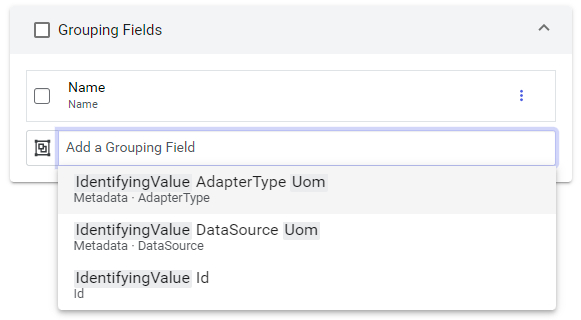

# Step 3.3: Configure grouping fields

You can organize the data items within a data view by grouping them, which is one method of producing a meaningful, consumable shape of data. Configure grouping fields using the **Grouping Fields** accordion panel. Grouping is optional when defining the data view.

Without grouping, all of the data items returned by a query appear side-by-side. If the view includes many data items, its data records will be vast. The fields are also likely to be ambiguous.

[Configuring identifying fields](#configure-identifying-fields) to identifying the items within each field set is one way to disambiguate the fields, but only one field may be an identifying field. What if multiple metadata fields are required to fully describe each data item? Grouping can organize the data items into shapes that are consumable, represent a physical asset, or both.

Only certain fields are eligible to be used as grouping fields. Fields are only eligible if they include one or more of the following source types:

Fields are only eligible if they include one of the following source types listed in the table below. All source types require a field label. Some source types also require having a key defined. The following table lists eligible data sources along with additional requirements for field labels and keys.

| Eligible source type | Field label required? | Key required? |
|----------------------|-----------------------|---------------|
| Id                   | ✔                    | &#10006;      |
| Name                 | ✔                    | &#10006;      |
| Metadata             | ✔                    | ✔             |
| Tags                 | ✔                    | ✔             |

To add a grouping field, select **Add a Grouping Field** and choose an eligible field. You can add as many eligible fields as you prefer.

**Add a grouping field**

- If you define **Grouping Fields**, the data view shows multiple groups, each with the list of data items for the group and its field values displaying. If a data item does not match any group, it is added to all groups.

	Within the data view preview, groups are ordered alphabetically by the first grouping value for each group. Within each group, data items are ordered alphabetically by data item id.

	If you are using multiple grouping fields, you can arrange their order by drag and drop. For more information, see [Configure field order](#configure-field-order).

- If **Grouping Fields** is not defined on the data view, the resolved data view shows a single group with all eligible data items.
  
