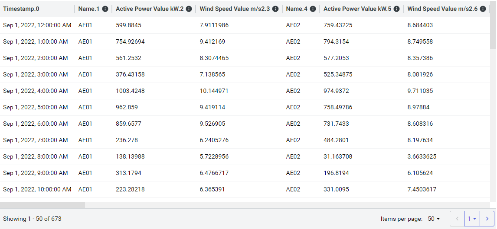
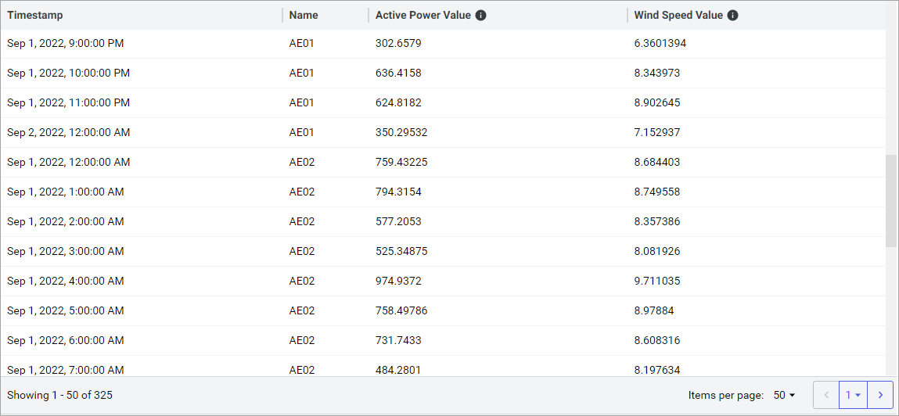

# Edit grouping fields

You can organize the data items within a data view by grouping them, which is one method of producing a meaningful, consumable shape of data. Configure grouping fields using the **Grouping Fields** accordion panel. Grouping is optional when defining the data view.

Without grouping, all of the data items returned by a query appear side-by-side. If the view includes many data items, its data records will be vast. The fields are also likely to be ambiguous.

Configuring identifying fields to identify the items within each field set is one way to disambiguate the fields (more on this in the next topic), but only one field may be an identifying field. What if multiple metadata fields are required to fully describe each data item? Grouping can organize the data items into shapes that are consumable, represent a physical asset, or both.

Only certain fields are eligible to be used as grouping fields. Fields are only eligible if they include one of the following source types listed in the table below. All source types require a field label. Some source types also require having a key defined. The following table lists eligible data sources along with additional requirements for field labels and keys.

| Eligible source type | Field label required? | Key required? |
|--|--|--|
| Id |  |  |
| Name |  |  |
| Metadata |  |  |
| Tags |  |  |

- If you define **Grouping Fields**, the data view shows multiple groups, each with the list of data items for the group and its field values displaying. If a data item does not match any group, it is added to all groups.

	Within the data view preview, groups are ordered alphabetically by the first grouping value for each group. Within each group, data items are ordered alphabetically by data item id.

	If you are using multiple grouping fields, you can arrange their order by drag and drop. For more information, see <xref:data-view-configure-field-order>.

- If **Grouping Fields** is not defined on the data view, the resolved data view shows a single group with all eligible data items.

## Grouping field example

Use grouping fields to group metadata and data fields in a data view by asset name so that each row contains only the data and metadata for a single asset.

**Without grouping**

**Grouping by asset name**

## To add a grouping field

To add a grouping field, select **Add a Grouping Field** and choose an eligible field. You can add as many eligible fields as you prefer.

1. From the **Grouping Fields** accordion, select **Add a Grouping Field**.

	

1. Choose a grouping field.

    **Note:** The list of available fields only includes fields that you have added to the field set. If you want to choose a different field that is not listed, you must first add it to the field set. For more information on adding fields to an existing data view field set, see <xref:data-views-manage-data-fields>.

1. (Optional) Repeat the steps above to add additional grouping fields.

## To ungroup a field

To ungroup a field, select **More options**  > **Ungroup Field** > **All Eligible Queries**.

## To remove a grouping field

Removing a field from grouping fields completely removes the field from the data view rather than merely ungrouping it.

To remove a field, select **More options**  > **Remove**.

## Other grouping tasks

Similar to field sets, the following tasks can be performed on grouping fields:

- <xref:data-view-edit-data-fields>
- <xref:data-view-link-fields>
- <xref:data-view-configure-field-order>
