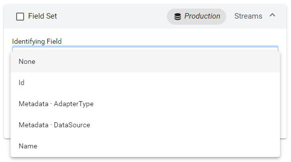

# Step 3.4: Edit identifying fields

An identifying field can be used to uniquely identify data items within a group. For example, if a query contains a ambiguously named stream property such as `Value`, you might choose a metadata property that uniquely describes the stream as the identifying field. 

If the field set resolves to multiple data items in any group (or if grouping is not used), then you should designate an **Identifying field** for the field set. The identifying field of a data field set specifies the primary field to identify multiple items in a group. This identification method allows the identifying field value to be used automatically in field labels of the group. If a lone criterion is not a sufficient or useful way of disambiguating the fields, then grouping by additional criteria may be necessary. 

Fields are only eligible if they include one of the following source types listed in the table below. All source types require a field label. Some source types also require having a key defined. The following table lists eligible data sources along with additional requirements for field labels and keys.

| Eligible source type | Field label required? | Key required? |
|----------------------|-----------------------|---------------|
| Id                   | ✔                    | &#10006;      |
| Name                 | ✔                    | &#10006;      |
| Metadata             | ✔                    | ✔             |
| Tags                 | ✔                    | ✔             |

## To add an identifying field

To add an identifying field to the field set for a query, select an eligible field from the **Identifying field** dropdown.

1. From the **Identifying Fields** accordion, select **Add an Identifying Field**.

	

1. Choose an identifying field.
