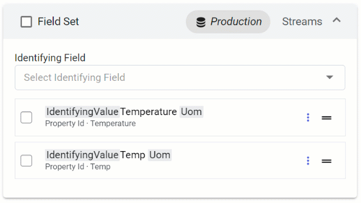

# Step 3.5: Link fields

Data items included in a data view may have slight differences in property naming, despite those properties representing the same logical thing. For example, data from one equipment manufacturer reports `Temperature`, while another reports `Temp` instead.

Data views can overcome property naming differences by linking these similar properties into a single data field. This applies to stream properties referenced by id or by name, and to stream metadata keys. Asset properties can also be linked.

## To link fields

To link data items, drag and drop one field onto another. Properties can only be linked to other properties of the same data type. Metadata can only be linked to other metadata of the same data type.

## To unlink fields

To unlink a linked field, select **More options**  >  **Unlink All**.

## Developer documentation

Within the Developer Guide, the term "linking" is synonymous with "consolidating". For more information, see <xref:ConsolidateDataFields>.

## Next steps

Proceed to <xref:data-view-configure-field-order>.