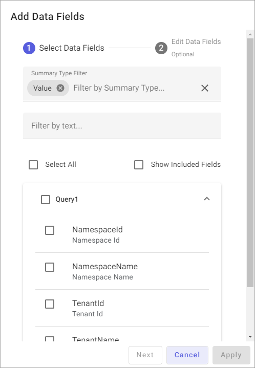
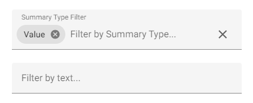

# Step 3: Select data field sets

After you save the queries that you create in the previous step, AVEVA Data Hub prompts you to add data fields to the field set for each query in the `Add Data Fields` window. Data fields are metadata or properties from streams or assets that are included in your data view.

**Add Data Fields window**

## To select data fields

From the `Add Data Fields` window, select the fields that you want to include in your data view. If you have more than one query, select fields for each query.

**Tips:**

- Use the data field filters to find a specific field. For more information, see [Data field filters](#data-field-filters).

- To display which fields are already included in the data view, select **Show Included Fields**.

## Data field filters

You can filter the data fields listed for each query by [summary type](#filter-by-summary-type) or by [text](#filter-by-text).

### Filter by summary type

You can filter the data fields listed for each query by summary type, which returns different calculations for a given data field. The `Value` summary type is selected by default.

- To add a summary type chip, select the **Filter by Summary Type** field and select a value.

- To remove a summary type tag, select  for the chip.

- To remove all summary type tags, select  for the **Filter by Summary Type** field.

### Filter by text

You can further filter the data fields listed for each query by field name or field type—in other words, by metadata or property id.

## Next steps

After you choose data fields, perform one of the following actions:

- Apply options to your data field sets. Select **Next** to edit the selected data fields and apply other field set options. Proceed to <xref:data-views-field-set-options>.

- If you are satisfied with your field sets, select **Apply** and proceed to <xref:data-view-choose-data-shape>.
