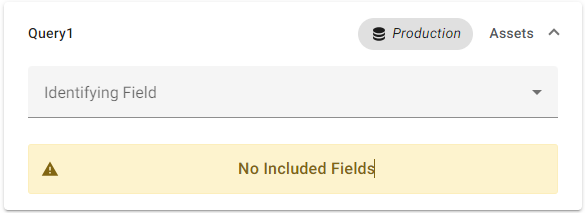
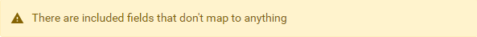
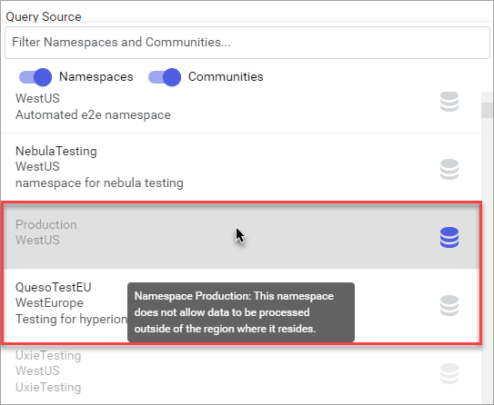
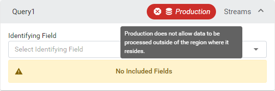

# Data view troubleshooting

While working with data views, you may encounter warnings about your data view configuration settings. This topics details possible warnings and how to address them.

## Data Views page

While browsing the list of data views, you may encounter the following warnings.

### Alert chip

Query sources that include a yellow alert chip indicate that you have a permissions issue affecting your view of the data view. There are two context for when an alert chip displays:

- **Unknown community chip**

    

    Alert chips that read `Unknown Community` indicate that you have insufficient permissions to access the community or that has been deleted. You must be a member of the community to access its data. Additionally, you cannot edit the query for the community until you are member of the community. Request that a community administrator add you to the community.

- **Read access chip with community name**

    

    Alert chips that display the community name indicate that you are a [Community Administrator](xref:community-community-roles#community-administrators) or [Community Member](xref:community-community-roles#community-member) with read access, but not a member of the community itself. Community Administrators can use the visible community name to add users to the community. For more information on adding a user to the community, see <xref:community-manage-users>.

## Data View page

You may encounter the following warnings while editing a data view.

### `No included fields`

If the field set for a query includes no fields, an alert of `No Included Fields` displays. You can correct this error by adding one or more fields to the query. For more information, see <xref:data-views-manage-data-fields#to-add-data-fields-to-field-set>.

**No Included Fields**



### `There are included fields that don't map to anything`

If one of your queries includes fields that do not map to anything, an error of `There are included fields that don't map to anything` displays at the bottom of the field sets.

**Field set error**



You can correct this error by finding the individual fields that do not map to anything and removing them. Fields that do not map to anything are denoted by the alert  icon. For more information on removing a field from a field set, see <xref:data-views-manage-data-fields#to-add-data-fields-to-field-set>.

## Manage Queries

While managing data view queries, you may encounter the following warning.

### Cross region processing disabled

If you encounter a warning of `This namespace does not allow data to be processed outside of the region where it resides`, this message indicates that the namespace has opted out of sharing its data across regions, and the currently selected namespace has a different primary geographical region. Therefore, the data view cannot be processed in the currently selected namespace. For additional information, see <xref:cross-region-data-sharing>.

You can encounter the message above in different contexts:

- **While adding a query**

    While you are adding a query, AVEVA Data Hub compares the region of the current namespace against the region of the namespace you are adding to the data view. If you attempt to add a namespace that has opted out of cross region data sharing, and the currently selected namespace has a different geographical region than that namespace, the source is unavailable and therefore cannot be added. A tooltip displays if you mouse over the source:

    

- **While managing an existing query**

    If a data view is created that includes a namespace that later opts out of cross region data sharing, an alert displays in the **Query** panel that the data view includes a source that cannot be shared across region:

    

    When the query that includes a disabled source is selected, the following message displays:

    ```text
    Cross Region Data Sharing Disabled: This namespace does not allow data to be processed outside of the region where it resides.
    ```

#### Data view invalidation

[!include[data-view-opt-out](../../_includes/data-view-opt-out.md)]