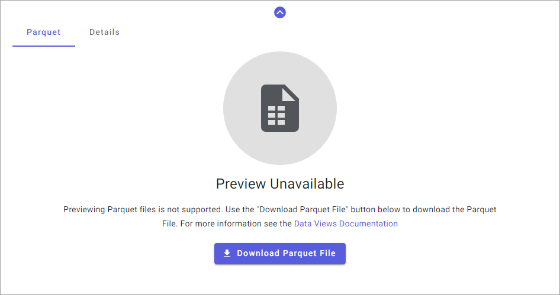

# Parquet data format

AVEVA Data Hub can output your data view in Apache Parquet, an open source, column-oriented data file format designed for efficient data storage and retrieval. This binary file format allows you to easily upload AVEVA Data Hub data into data lakes and data warehouses. Parquet is a common format for working with data in technologies like Databricks, Snowflake, Azure, AWS, and others.

## Parquet data serialization

<<<<<<< HEAD
When you request a data view in Parquet format, AVEVA Data Hub serializes the data from text-based data to the Parquet binary file format, which is not human-readable. To read the Parquet file, you will need to open it with a programming language routine or application capable of deserialization, such as Databricks, Snowflake, Azure, AWS, or another compatible application.
=======
When you request a data view in Parquet format, AVEVA Data Hub serializes the data from text-based data to the Parquet binary file format, which is not human-readable. To read the Parquet file, you will need to open it with a programming language routine application capable of deserialization, such as Databricks, Snowflake, Azure, AWS, or another compatible application.
>>>>>>> b38dfde333421d1422f47637acde769bc843498e

## Parquet file download

When you make requests against a dataview in the AVEVA Data Hub [API Console](xref:apiConsole) with the Parquet form selected, you can download the request as a Parquet file. Select **Download Parquet File** to download the file.

For more information on how to request a data view in the Parquet format, see <xref:data-view-api-console-use>.

**API Console: Download Parquet File**

## Handling multiple data types

When you request a data view that includes multiple data types in a single column:

1. The data view converts two or more SDS data types into a compatible SDS data type wide enough to accommodate all types without losing information. This conversion occurs to accommodate the strongly-typed data in the Parquet format.

1. The data view converts the compatible SDS data type to a Parquet data type. This conversion occurs because the Parquet format does not support all data types natively.

For more information on the conversion, see <xref:data-view-data-type-conversion>.
