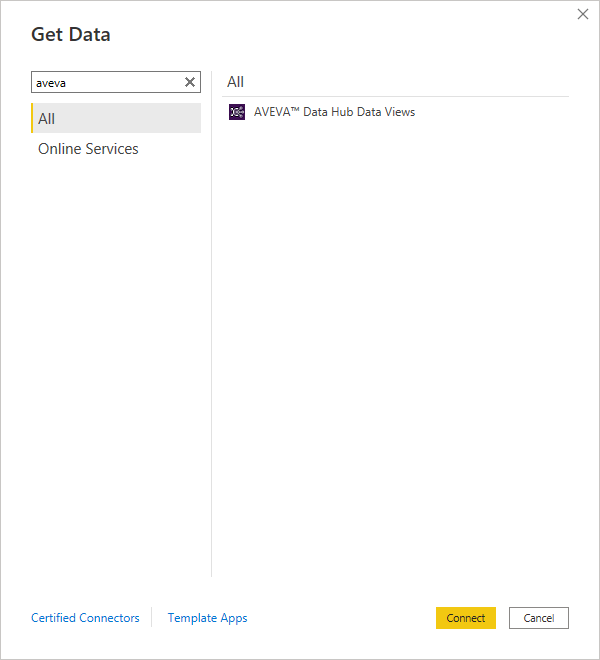
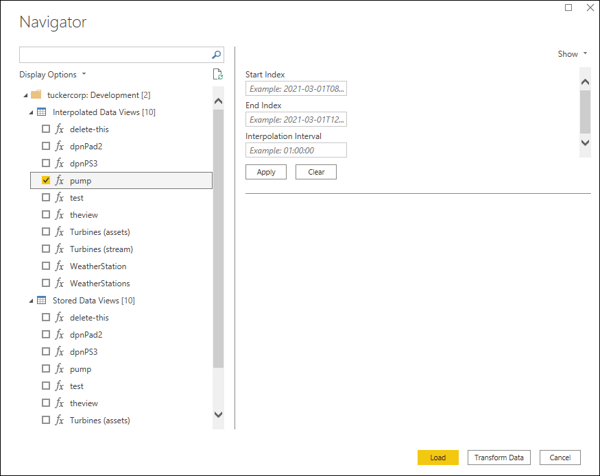
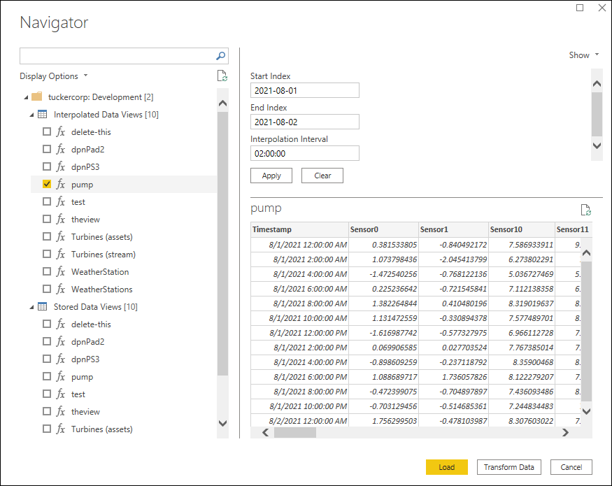

# Retrieve data view

Use AVEVA Data Hub Power BI Connector to retrieve AVEVA Data Hub data views for use in Microsoft Power BI.

To retrieve data views:

1. In Microsoft Power BI Desktop, in the entry field of the `Get Data` window, type `OSI`. The AVEVA Data Hub Data Views connector file displays in the `All` pane.

   

1. Select the `AVEVA Data Hub Data Views` connector file, and then select **Connect**.

1. Select **Continue** in the `Connecting to a third-party service` warning.

1. In the `AVEVA Data Hub Data Views` window, enter the tenant and namespace for the data views you want to access, and then select **OK**.

   The OSIsoft Cloud Services sign-in window displays if you have not already signed in.

    - If you have not already signed in, select **Sign in as different user** and complete the user authentication process.

1. In the `AVEVA Data Hub Data Views` sign-in window, select **Connect**.

1. In the `Navigator` pane, do one of the following: 

   - To get data using the stored retrieval mode, select **Interpolated Data Views**, and then select the data view to work with in Microsoft Power BI. 
   
   - To get data using the interpolated retrieval mode, select **Stored Data Views**, and then select the data view to work with in Microsoft Power BI.

   

1. For stored Data Views, specify a Start Index and End Index in `YYYY-MM-DDTHH:mm:ss` format for the selected data view, and select **Apply** to save the values. For interpolated data views, also specify an Interpolation Interval in `dd.hh:mm:ss` format. Repeat for each additional data view as needed.

    **Note**: If a data view has default values, enter new values and select **Apply** to accept the defaults.

   

1. Select **Load** at the bottom of the `Navigator` pane to load all selected Data Views to Microsoft Power BI.