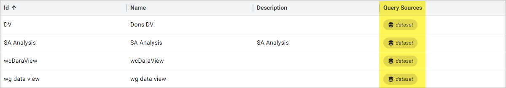

# Create and configure a data view

You create and configure a data view by defining the target namespace, and then specifying the source stream or asset, data fields, time period, and interpolation interval.

To create a data view:

1. In the left pane, select **Analytics** > **Data Views**.

1. In the `Data Views` pane, select **Add Data View**.

1. Complete the following fields:

   - **Name** - Enter a name to identify the data view.

   - **Description** - (Optional) Enter a description for the data view.

1. Select the **Data View Shape** from the following options to specify the general shape of the data display:

   - **Standard** - a typical wide table.

   - **Narrow** - pivot the data into a Field, Value pair format.

## Specify the source for the data view

1. In the center pane, update the **Query Id** field to a new value or accept the default of *Query1*.

1. From the **Query Source** dropdown menu, select a namespace  or community  to query.

1. For **Query Type**, select **Streams** or **Assets** to indicate which objects to search for this query.

   **Note:** Assets are available for use through specific licensing only. If you are interested in using Assets, contact your account team for more details.

1. For the **Query Value** search field, enter a portion of the name of any known stream or asset preceded or followed by the wildcard operator (`*`), and then select **Search** to search for available streams or assets.

   For more information on how to enter a query, see <xref:search>.

1. Select any stream or asset in the query results to display and view the individual data fields to the pane on the right.

   **Notes:**
   
   - If you have created a metadata rule in the same namespace, you can enter a selected metadata key instead of a stream or asset name in the **Search** field to display a more specific set of streams or assets.
   
   - View the **Tenant** column to identify the source tenant of a listed streams or asset. Additionally, if you select a stream or asset, more identification and source information displays in the side panel.

1. (Optional) To add more queries to the data view, select **Add Query**, enter the appropriate query value in the **Query Value** search field, and then select **Apply**.

1. Select **Save** to accept the query results as the basis of the data view.

## Add data fields to display as identifying fields for the data view

1. In the `Add Data Fields` window, select each data field or **Select All** data fields to use as an identifying field. **Show Included Fields** highlights identifying fields already included in the data field.

1. (Optional) To edit data field label, select **Next** and enter `{` to display tokens to use as a data field label.

      [!include[field label tokens](../../_includes/data-view-field-label-tokens.md)]

1. Select **Apply** to accept the selected data fields.

   The `Filter Fields` and `Generate Preview` panes display.

## Edit the identifying fields, time period, and interpolation interval for the data view

1. In the `Filter Fields` pane, the **Index Field** and **Grouping Fields** sections are set by default. In the queries section, each data field previously selected in the `Add Data Fields` pane is listed as an identifying field. To add, edit, or remove identifying fields, select **Add**, **Edit**, or **Remove**.

1. In the `Generate Preview` pane, turn the **Auto Refresh** toggle switch on to enable auto refresh. With auto refresh enabled, changes to any of the streams included in the data view are immediately reflected in the data view.

1. Select the date and time display to set the **Start Index** and **End Index** to enter the time period of the data to include in the data view. For interpolated data views, enter a `Time Interval`.

1. Select **Apply** to accept the index configuration changes.

1. Select the **Interpolated/Stored** dropdown list and select **Interpolated** or **Stored** for the data view.

## Generate a preview and save the data view

1. To generate a preview of the data view with the selected settings, select **Generate preview**.

1. Select **Save** to create the data view and to continue editing, or select **Save and Close** to create the data view and exit.

Your data view is added to the `Data Views` page. You can view the sources for each query in your data view from the **Query Sources** column. For data views with multiple query sources, press Shift+Mousewheel to scroll through the sources.

