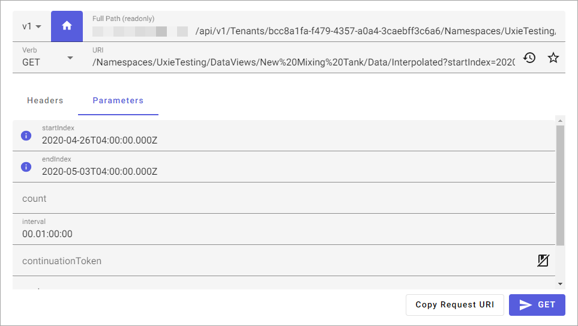

# API console

The API Console provides a graphical interface for using the CONNECT data services REST API. Developers can use this console to configure and test API requests before implementing them in their own applications. To use the API Console, select select **Developer Tools** > **API Console** from the left pane.

## Request area

Use the request area to configure an API request. Choose a version of the API, the request scope, the request verb, and the URI endpoint. This area is also used to configure the request header, body, and parameters.

### API version

Select a version from the dropdown list. For more information on the available versions, see [CONNECT data services API versioning](xref:osisoftCloudServices#aveva-data-hub-api-versioning).

### Tenant path

Select the **Root/Tenant path enabled**  icon to toggle between a tenant-scoped path or a root-scoped path. The **Full Path** field (which is readonly) updates according to your selection.

The **Full Path** field shows an encrypted version of the selections you have made. Based on your selections, other fields may also be automatically prepended to the path. Together, these fields produce a path to a REST endpoint.

### Verb

Use the **Verb** dropdown to select a request method. By default the API Console selects the `GET` method for new request. You can use a variety of other methods to send data to your APIs, including:

- `GET`: Retrieves data.
- `POST`: Adds new data.
- `PUT`: Replaces existing data.
- `DELETE`: Deletes existing data.
- `PATCH`: Updates existing data.

### URI

Use the **URI** field to enter an API route to make a request against. If your request is tenant-scoped, you can type a forward slash (/) in the field to display a dropdown list of path autocomplete options. If you select a root-scoped path, a different dropdown list gives you other categories of data.

For a complete reference of URI endpoints available in the CONNECT data services API, refer to the [API Reference](xref:osisoftCloudServices).

#### Path autocomplete

When entering a URI for an API request, the API console automatically suggests available identifiers for path completion. Additionally, a tag next to the identifier displays the resource name that it resolves to. Resources are listed in alphabetical order.

#### Session request history

Select the **Session request history**  icon to view a list of previous requests made from the API console.

#### Favorites

Select the **Favorites**  icon to add the configured API request to the **Favorites** list in the right pane. Use this feature when you find yourself making an API request repeatedly.

### Headers

Use the **Headers** tab to provide more metadata about the operation you are performing. Enter any key-value pairs you need to include in your request.

Calls to the API from other sources do not include `Accept-Verbosity` as a standard. The `Accept-Verbosity` heading needs to be specified.  If you do not include the the `Accept-Verbosity` heading, all calls except for data view calls will be `non-verbose` and dataview calls will be `verbose`.

When set to `non-verbose`, properties with null values are omitted from the response to reduce bandwidth. This behavior is only applicable to the JSON format, as all other formats represent a table which cannot have omitted values. Verbose has no impact on writes; writes return only error messages.

The default response format for SDS is JSON. Default JSON responses do not include any values that are equal to the default value for their type. Note that the `Accept-Verbosity` header for SDS differs as its default is set to `non-verbose`. Verbose has no impact on writes; writes return only error messages.

### Request body

When making `POST`, `PUT`, or `PATCH` requests, you can enter your JSON payload in the **Body** area.

### Parameters

When making `GET` requests, you can specify parameters available for the route on the **Parameters** tab. The parameter fields available will change based on the route configured in the URI field. Query parameters are appended to the end of the request URI. For more information on the parameters available for each route, refer to the [API Reference](xref:osisoftCloudServices).

#### Continuation token

The continuation token field is used in support of server-side pagination. A continuation token is a mechanism used to handle large amounts of data efficiently. When you request data from a data view using the CONNECT data services REST API, there might be too many results to retrieve all at once. To address this, the API provides you with a subset of the data and a continuation token.

The continuation token parameter is available when working with streams or data views. When working with streams, select the checkbox to include the parameter in your request when no value is set.

The continuation token serves as a marker or reference point that helps you keep track of your progress and indicates where you left off. When you want to fetch the next portion of the data, you include the continuation token in your subsequent API request. Continuation tokens are only supported for `GET` requests.

When the **Load from Response**  button is enabled, the continuation token from the last API console data view request is loaded into the **continuationToken** field automatically. The continuation token will be loaded from the response when all of the following conditions are met:

- The request verb is `GET`.
- There is a response present.
- The current response verb, path, and query parameters (excluding the **continuationToken**) all match the current request.

### Copy request URI

This button copies the request URI to your clipboard.

### Execute request

When you are done configuring your API request and are ready to make your call, select the **Execute request** button. The label on the button changes according the method that you selected.

**Warning:** Making a `POST`, `PUT`, `DELETE`, or `PATCH` request will alter your data. Use these methods with care.

## Response area

Use the response area to view the API response to your previous request. This area includes metadata about the request, along with the response payload.

### Body

The **Body** tab displays the JSON payload returned by the API following a request.

### Table

The **Table** tab displays the JSON response body in tablular form.

### CSV

For routes that support responses in CSV format, such as Data Views, a CSV tab is available. This tab displays the response body as CSV.

### Parquet

When making requests to the <xref:data-views-data-views-data> route, responses are available in the Parquet format.

### Trend

Some routes include a **Trend** tab that you can use to visualize data.

### Details

The **Details** tab lists metadata related to the previous API request, including:

- **URI Path**: This field displays the method and URI used in the previous API request. Select **Copy**  to copy the URI to your clipboard.

- **HTTP status**: The server issues HTTP response status codes when a client makes a request over HTTP. In response to the requests made to CONNECT data services, the system returns a status code. For more information about the possible status codes, see <xref:ocsStatusCodes>.

- **Link**: For `GET` requests that include a [continuation token](#continuation-token), one or more link header is included in support of pagination. Each header is a clickable link that updates the request metadata.

### Toolbar icons

While making requests using the API console, you can copy or download the response body by choosing the appropriate icon.

- Choose **Copy**  to copy the response body to your clipboard.
- Choose **Download**  to download the response body.

When working with Data Views resources, response bodies are downloaded in the file format specified in the **form** dropdown. Response bodies for other resources are downloaded as JSON.
