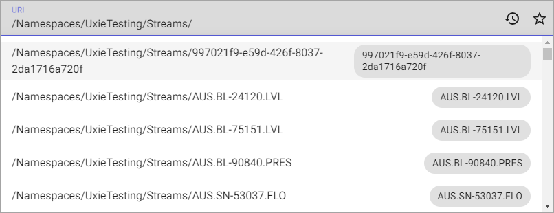

# API console

The API Console provides a graphical interface for using the REST API. When using the API Console, you select a GET, POST, PUT, DELETE, or PATCH action, select the objects for the action, and execute.

To use the API Console:

1. In the left pane, select **Developer Tools** > **API Console**.

1. Select a version from the dropdown list.

1. Select the **Root/Tenant path enabled** icon to toggle between a tenant-scoped path or a root-scoped path.

1. Select an action from the **GET/POST/PUT/DELETE/PATCH** dropdown list.

1. Type a slash (/) in the text field to display a dropdown list.

1. If you selected a tenant-scoped path in the second step, you can take any of the following actions:

  - Select **Namespaces** and then select a namespace followed by an endpoint or route.

  - Select **Communities** and then select from a dropdown list of communities followed by an endpoint or route.

  - Select **OmfValidation** to validate an Open Message Format (OMF) JSON message.

  If you selected a root-scoped path in the second step, a different dropdown list gives you other categories of data. You can select one and then select an appropriate endpoint or route.

  The **Full Path** field shows an encrypted version of the selections you have made. Based on your selections, other fields may also be automatically prepended to the path. Together, these fields produce a path to a REST endpoint.

  **Tip:** Namespace- and community-scoped API requests autosuggest resource identifiers. For more information, see [Path autocomplete](#path-autocomplete).

1. Select the blue button in the lower right, which shows the action you selected earlier.

  The request to the endpoint is issued based on the path you have constructed. For **POST** and **PUT** requests, the **Body** entry field displays. Type the request body into the **Body** entry field.

  **History** records the calls that you make so you can replay them again.

## Path autocomplete

When entering a URI for a namespace- or community-scoped API request, the API console automatically suggests available identifiers for path completion. Additionally, a chip next to the identifier displays the resource name that it resolves to. Resources are listed in alphabetical order.

## Related

For more information, see [Stream data](xref:sds-stream-data).