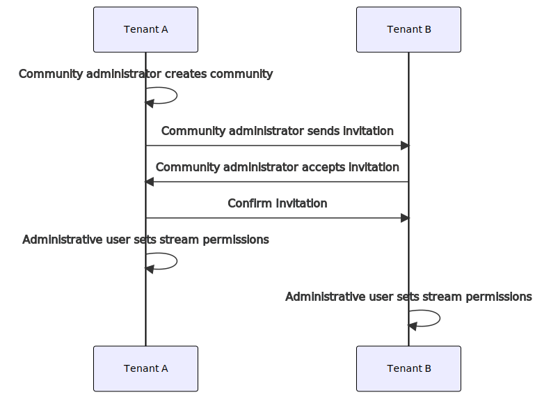

# Workflow: Community setup

Setup of a community involves coordination between multilple tenants and users with different permissions. Before you start setup of a community, review the figure below to better understand the entire community setup process.

**Note:** This figure offers a high-level view of the entire community setup process. For more information on low-level details on completing the setup process, see the topics that follow this one.

**Workflow: Community setup**

## Next steps

Proceed to <xref:community-community-roles>.