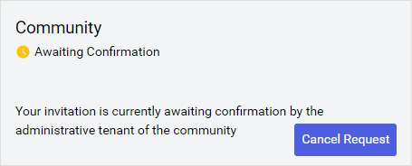
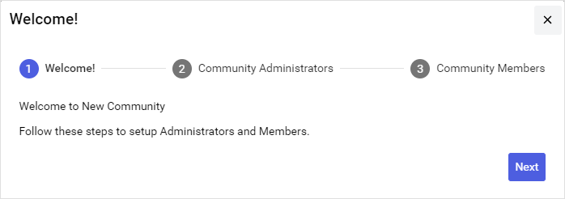

# Part 1: Accept community invitation

When another tenant invites you to a community, you receive an email invitation that you can use to join. 

**Note:** Invitations are valid for 14 days before they expire. If you do not accept the invitation within that time, or you do not receive an invitation email, you must request a new invitation from the owning tenant.

To accept an invitation, follow these steps:

1. Open and review the email invitation from OSIsoft Cloud Services (OCS).

1. Select the **VIEW COMMUNITY INVITE** link.

1. If prompted, enter the tenant ID or tenant alias for your tenant and select **Continue**.

  **Important!** If you have multiple tenants, verify that you are logging into the correct tenant.

1. If prompted, log in to OCS.

  A page opens and displays that your tenant will join the community that issued the invitation.

1. Select **Join**.

  

  The tenant that invited you to the community is updated that you accepted their invitation.

1. Wait for a Community Administrator from the inviting tenant to confirm your tenant. Your tenant does not officially join the community until the inviting tenant confirms the invitation.

  

  When the administrative tenant confirms your tenant, you receive a notification email.
 
1. After your tenant is confirmed for the community, select **Details** to setup Community Administrators and Community Members for your tenant.

  

  A setup wizard opens.

1. From the **Welcome** page, select **Next**.

   

1. On the `Community Administrators` page, choose the [roles](xref:ccRoles) that are assigned [community administration permissions](xref:community-community-roles#community-administrators). Users assigned these roles can perform administration tasks within their own tenant, but not the entire community. You can either accept the default roles or add new ones. 
   
    [!include[details-choose-community-admin](includes/details-choose-community-admins.html)]

1. After you finish, select **Next**.

1. On the `Community Members` page, add [Community Members](xref:community-community-roles#community-member), which are Members within your tenant that have read access to the community and its data.
    
    [!include[details-choose-community-admin](includes/details-choose-community-members.html)]

1. After you finish, select **Save & Close**.

## Next steps

Edit permissions for data streams to allow tenant data stewards to share them with the community. Continue to <xref:community-manage-sds-permissions-join>.
