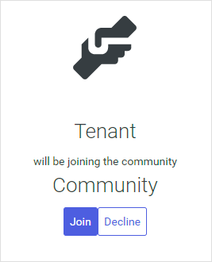
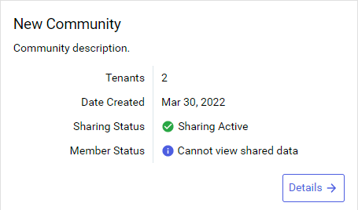

# Step 1: Accept community invitation

When another tenant invites you to a community, you receive an email invitation that you can use to join.

**Note:** Invitations are valid for 14 days before they expire. If you do not accept the invitation within that time, or you do not receive an invitation email, you must request a new invitation from the administrative tenant.

## Prerequisites

[!include[prereq-community-admin](includes/prereq-community-admin.md)]

## To accept an invitation:

1. Open and review the email invitation from AVEVA Data Hub.

1. Select the **VIEW COMMUNITY INVITE** link.

1. If prompted, enter the tenant ID or tenant alias for your tenant and select **Continue**.

  **Important!** If you have multiple tenants, verify that you are logging into the correct tenant.

1. If prompted, log in to AVEVA Data Hub.

  A page opens and displays that your tenant will join the community that issued the invitation.

1. Select **Join**.

  

  The tenant that invited you to the community is updated that you accepted their invitation.

1. Wait for a Community Administrator from the inviting tenant to confirm your tenant. Your tenant does not officially join the community until the inviting tenant confirms the invitation.

  When the administrative tenant confirms your tenant, you receive a notification email.

  **Tip:** You can view or cancel your invitations that are pending confirmation from the `Communities` page. For more information, see <xref:community-view-invitations>.

1. After your tenant is confirmed for the community, select **Data Management** > **Communities**, choose your community, and then choose **Community Details** to set up Community Administrators and Community Members for your tenant.

  

  A setup wizard opens.

1. From the **Welcome** page, verify the **Contact Email** address and then select **Next**.

  The **Contact Email** is an email address that your business partners can use to contact you for any questions or issues related to this community. This field defaults to the email address for your user account, but you can override it by selecting  and entering a new address.

  **Tip:** You can update your **Contact Email** later. For more information, see <xref:community-contact-email>.

1. On the `Community Administrators` page, choose the [roles](xref:ccRoles) that are assigned [community administration permissions](xref:community-community-roles#community-administrators). Users assigned these roles can perform administration tasks within their own tenant, but not the entire community. You can either accept the default roles or add new ones.

   - To add community administrator permissions to a user role, select **Add Roles** > **Add Role**  for any role that you want to function as community administrator.

   - To remove community administrator permissions from a user role, select **Remove Role**  for the role that you want to remove.

  **Tip:** You can edit the default roles that are listed. For more information, see <xref:communities-manage-default-admins>.

1. After you finish, select **Next**.

1. On the `Community Members` page, add [Community Members](xref:community-community-roles#community-member), which are members within your tenant that have read access to the community and its data.

  To add new Community Members, select **Add Members** > **Add User**  for each user or group that you want to add.

  **Note:** Community Administrators are not automatically added as Community Members. If you want your Community Administrators to also be Community Members with access to shared resources, you must manually add them.

1. After you finish, select **Save & Close**.

## Next steps

Edit permissions for data streams to allow tenant data stewards to share them with the community. Continue to <xref:community-manage-sds-permissions-join>.
