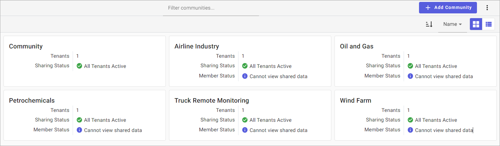

# Communities page

The `Communities` page, accessible at **Data Management** > **Communities**, is the entry point for creating and participating in communities. Depending on your user roles and permissions, this page displays a different inventory of communities:

- If you are a [Community Administrator](xref:community-community-roles#community-administrators), this page lists *all* communities that your tenant participates in, along with their high-level details. 

- If you are a [Community Member](xref:community-community-roles#community-member), this page lists only the communities that you hold membership in. 

The image above displays the `Communities` page. Review the headers below for more information on each callout depicted in the image.

## Community tile

For each community that your tenant participates in OCS, a tile is listed on the `Communities` page. From this tile, you can review high level details for the community and view if you have access to view data streams from the community.

The following table describes each field in a community tile:

| Field | Description |
|--------|-------------|
| **Tenants** | The number of tenants participating in the community. |
| **Date Created** | The date that the community was created. |
| **Sharing Status** | Indicates whether on or more tenant in the community is sharing a data stream. Statuses include: <ul><li><strong>Sharing Active</strong>: The community currently allows its members to view shared data streams in <code>Sequential Data Store</code>.</li><!--<li> TODO: Add another status for pausing?</li>--></ul>|
| **Member Status** | Indicates whether you are [Community Member](xref:community-community-roles#community-member) and can view data shared to the community within `Sequential Data Store`. If the field displays a status of `Cannot view shared data`, then you are not a Community Member. If you are a Community Member, this field is omitted.|

Select **Details** to administrate the community. For more information on administrative actions, see the following topics:

- <xref:community-community-administration>
- <xref:community-tenant-administration>

## Filter communities

Use the **Filter communities** field to find a specific community.

## Add Community

If you are a [Community Administrator](xref:community-community-roles#community-administrators), you can use **Add Community** to create a new community. For more information on this process, see <xref:community-workflow-create>.

## Manage Default Community Administrators

Select **More options**  > **Manage Default Community Administrators** to configure which roles are automatically added as the default Community Administrators while you are creating or joining a groups. For more information, see <xref:communities-manage-default-admins>.
