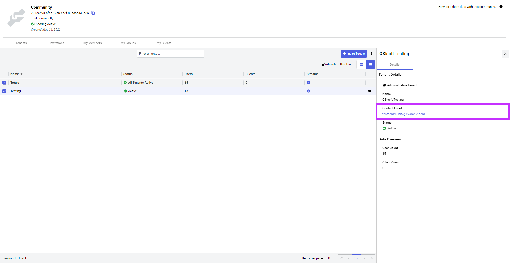

# Configure contact email

After your tenant provides an initial contact email during the invitation process, you can later update the contact email for the tenant if it changes.

## Prerequisites

[!include[prereq-community-admin](includes/prereq-community-admin.md)]

## To configure a contact email

1. In the left pane, select **Data Management** > **Communities**.

1. Select the community you want to edit and choose **Community Details**.

1. Select **More Options**  > **Edit Community**.

1. Edit the community **Contact Email**.

1. Select **Update**.

The contact email for the tenant is updated. Other tenants can view your contact information by browsing to the community and selecting the **Tenants** tab. Your contact email is displayed in the right pane when your tenant is selected, as shown below.

