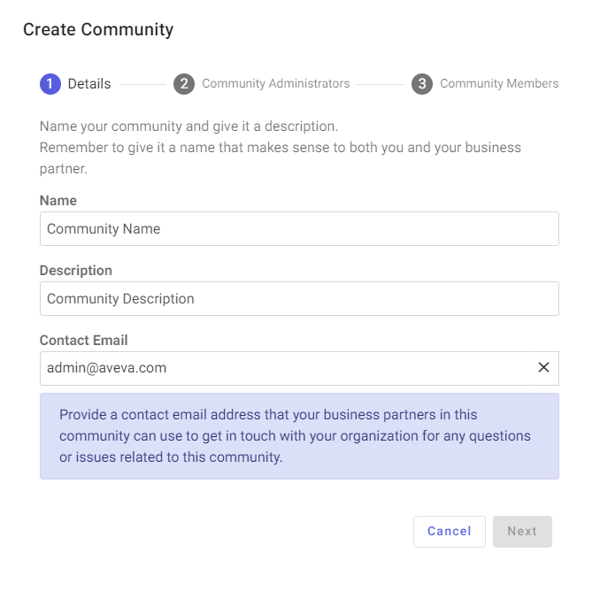

# Part 1: Create a community

[!include[create-community-intro](includes/create-community-intro.md)]

## Prerequisites

[!include[prereq-administrative-tenant](includes/prereq-administrative-tenant.md)]

## To create a community

To create a community, follow these steps:

1. In the left pane, select **Data Management** > **Communities**.

1. Select **Add Community**.

    The **Create Community** wizard opens to the `Details` page.
    

1. On the `Details` page, enter a **Name** and **Description**. Then select **Next**.

1. On the `Community Administrators` page, choose the [roles](xref:ccRoles) that are assigned [community administration permissions](xref:community-community-roles#community-administrators). Users assigned these roles can perform administration tasks for both their own tenant and the entire community. You can either accept the default roles or add new ones.

    [!include[details-choose-community-admin](includes/details-choose-community-admins.html)]

1. After you finish, select **Next**.

1. On the `Community Members` page, add [Community Members](xref:community-community-roles#community-member), which are users within your tenant that have read access to the community and its data.
    
    [!include[details-choose-community-admin](includes/details-choose-community-members.html)]

1. After you finish, select **Create**.

The community is created and added to the `Communities` page.

## Next steps

Invite tenants to your community. Continue to <xref:community-invite>.
