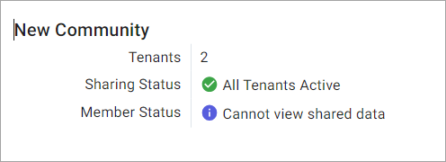

# Step 1: Create a community

[!include[create-community-intro](includes/create-community-intro.md)]

## Prerequisites

[!include[prereq-administrative-tenant](includes/prereq-administrative-tenant.md)]

## To create a community

To create a community:

1. In the left pane, select **Data Management** > **Communities**.

1. Select **Add Community**.

    The **Create Community** wizard opens to the `Details` page.

1. On the `Details` page, enter the following information and select **Next**: 

| Detail | Description |
|--|--|
| **Name** | The name of the community. |
| **Description** (optional) | A description of the community. |
| **Contact Email** | An email address that your business partners can use to contact you for any questions or issues related to this community. This field defaults to the email address for your user account, but you can override it by selecting  and entering a new address. 

**Tip:** You can update your **Contact Email** later. For more information, see <xref:community-contact-email>.

1. On the `Community Administrators` page, choose the [roles](xref:ccRoles) that are assigned [community administration permissions](xref:community-community-roles#community-administrators). Users assigned these roles can perform administration tasks for both their own tenant and the entire community. You can either accept the default roles or add new ones.

   - To add community administrator permissions to a user role, select **Add Roles** > **Add Role**  for any role that you want to function as community administrator.

   - To remove community administrator permissions from a user role, select **Remove Role**  for the role that you want to remove.

    **Tip:** You can edit the default roles that are listed. For more information, see <xref:communities-manage-default-admins>.

1. After you finish, select **Next**.

1. On the `Community Members` page, add [Community Members](xref:community-community-roles#community-member), which are users within your tenant that have read access to the community and its data.
    
    To add new Community Members, select **Add Members** >  for each user or group that you want to add.

    **Note:** Community Administrators are not automatically added as Community Members. If you want your Community Administrators to also be Community Members with access to shared resources, you must manually add them.

1. After you finish, select **Create**.

The community is created and added to the `Communities` page.

## Next steps

Invite tenants to your community. Continue to <xref:community-invite>.
