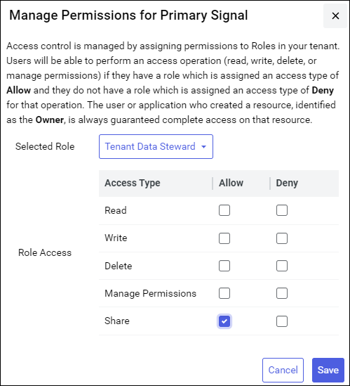

# Part 3: Enable stream sharing permissions

After you create a community, you must explicitly allow your Community Members to share data streams within the community. You can complete this action by browsing to the Sequential Data Store, selecting streams for permission management, and then applying permission updates to existing tenant roles. You can enable stream sharing permissions on a per-stream basis. Users assigned the updated roles for each stream will then have permission to share specific streams within a community. For instructions on how to allow stream sharing, see [Manage permissions](xref:manage-streams#manage-permissions).

**Manage SDS permissions: enable sharing for the Tenant Data Steward role**
