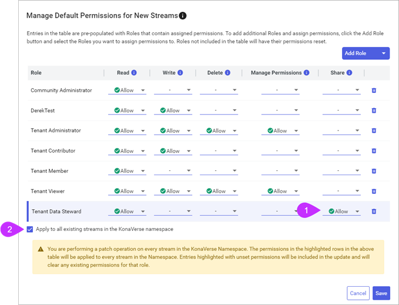
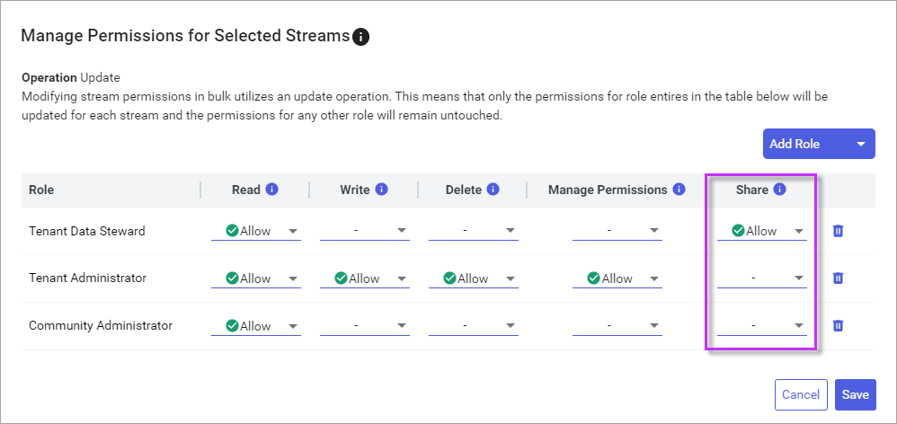

# Step 3: Enable stream sharing permissions

Before data can be shared into a community and accessed by external tenants, a user with the **Share** permission on one or more streams in the `Sequential Data Store` must share the streams into a community that they have read access to. By default, the [Tenant Data Steward](xref:ccRoles) role is intended for users in the tenant to share resources with other external tenants using communities. However, the Tenant Data Steward role is not assigned the **Share** permission on streams by default. Therefore, an administrative user assigned **Manage Permissions** on the streams must first grant the Tenant Data Steward role the **Share** permission on streams before they can be shared by users within that role. Granting **Share** permissions to the Tenant Data Steward role is recommended, but you can give those permissions to other roles instead.

## Prerequisites

[!include[prereq-share-streams](includes/prereq-share-streams.md)]

## To enable stream sharing permissions

When enabling stream sharing permisions, you can either enable them for an entire namespace or on an ad hoc, stream-by-stream basis. Enabling streams for an entire namespace is more convenient; enabling streams ad hoc is more secure.

### [Namespace](#tab/tabid-1)

You can change permissions for all streams in a namespace with a single action. 

1. From the left pane, select **Data ManagemenAt** > **Sequential Data Store**.

1. From the **Namespace** dropdown list, select the namespace that includes the streams that you want to share.

1. Select **More options**  > **Manage Default Permissions**.

	The the `Manage Default Permissions for New Streams` window opens.

1. Allow **Share** permissions for the user roles that you want to be able to share data.  

	1. Update each applicable **Share** permission dropdown list to **Allow**. If necessary, select **Add Role** to add a new role.

	1. Select **Apply to all existing streams in the namespace**. 
	
	

	**Note:** For more information on this window, see [Manage Permissions window](xref:permissions-management#manage-permissions-window).

1. Select **Save**.

### [Ad hoc](#tab/tabid-2)

To apply sharing permission to specific streams in a namespace:

1. From the left pane, select **Data Management** > **Sequential Data Store**.

1. Select one or more streams that you want to allow sharing on.

1. From the right pane, select **Manage Permissions**.

	**Note:** If you only have one stream selected, select **More options**  > **Manage Permissions** instead.

	The the `Manage Permissions for Streams` window opens.

1. For user roles that you want to have the ability to share data, update each **Share** permission dropdown list to **Allow**.

	

	**Tips:** For more information on this window, see [Manage Permissions window](xref:permissions-management#manage-permissions-window).

1. Select **Save**.

***

To configure different roles to allow different data stewards to share different sets of data, do not use the default Tenant Data Steward role and instead create the number of roles needed to manage this within your organization. Then repeat the steps above to grant the share permission for those roles on the specific sets of streams/data that each role will manage.

## Next steps

Communicate to your tenant data stewards that your tenant's data streams are available to share into a community. For more information about sharing streams, see [Share streams](xref:community-manage-shared-streams#share-streams).
