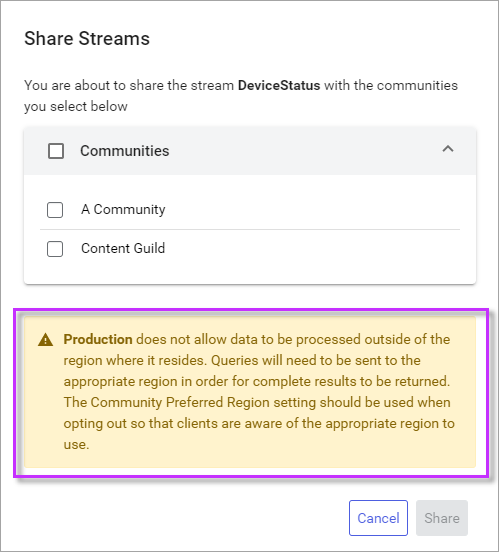

# Manage shared streams 

Users assigned share permissions for data streams in `Sequential Data Store`—also known as _data stewards_—can share those streams into communities where they are a member. These same users can unshare data streams from communities as well.

## Prerequisites

[!include[prereq-share-streams](includes/prereq-share-streams.md)]

## Share streams

User with permissions to share a data stream within a community can do so from the Sequential Data Store page. To share streams with other communities:

1. In the left pane, select **Data Management** > **Sequential Data Store**.

1. If it is not already selected, select **Streams** from the upper-left dropdown list.

1. Select one or more streams to share with a community.

    **Tip:** Use the **Search for streams** field to search for specific streams. For more information on using this field, see <xref:Search>.

1. From the right pane, select **Share Streams**.

	**Tips:**

    - If you only have one stream selected, select **More options**  > **Share Stream** instead.

    - If **Manage Permissions** is unavailable, you do not have permissions to share a selected stream. You must request permissions from a user that can manage stream permissions. For more information, see <xref:community-enable-stream-sharing-permissions>.

    - When sharing a large numbers of streams, edit the **Items per page** dropdown to a value that accommodates the number of streams that you want to share.

1. From the `Share Streams` window, confirm the streams you are about to share, and then select the communities that you want to them with, and then select **Share**. 

   **Getting `Namespace does not allow data to be processed outside of the region where it resides`?** See [Namespace warning](#namespace-warning).
    
The chosen streams are shared with the chosen communities. All members of the selected communities are able to read data from the shared streams.

## Unshare streams

When you want to stop sharing streams with a community, you can unshare them from the `Communities` page.

1. In the left pane, select **Data Management** > **Communities**.

1. Select the community where you are sharing streams and choose **Community Details**.

1. On the `Community Details` page, select the **Tenants** tab.

1. Select your own tenant. A pane opens on the right.

1. On the **Streams** tab, select the streams you want to stop sharing, then select **Unshare Streams**. Confirm the streams you are unsharing, and then select **Unshare**.

The streams are unshared from the community. Other tenants in the community can no longer view them.

## Namespace warning

If you receive the following warning while sharing streams from a namespace into a community a namespace, you can resolve it by updating the Community Preferred Region setting to the appropriate region. For more information on how to change this setting, see <xref:community-manage-preferred-region>.

