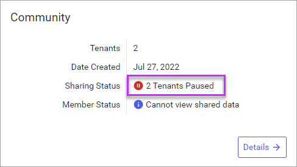
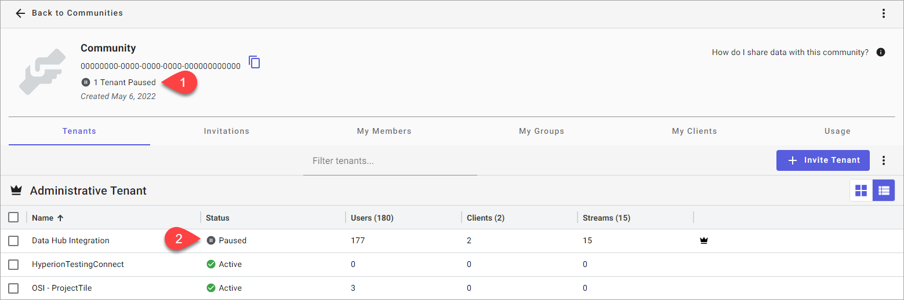

# Pause sharing a community

Community Administrators can temporarily pause the data streams that their tenant is sharing into a community so that other tenants cannot access them.

## Prerequisites

[!include[prereq-community-admin](includes/prereq-community-admin.md)]

## Pause sharing

To pause sharing data streams from your tenant into a community, follow these steps:

1. In the left pane, select **Data Management** > **Communities**.

1. Select the community that you want to pause sharing for and choose **Community Details**.

1. Select **More Options**  > **Pause Sharing**.

1. In the confirmation window, select **Pause**.

	Your tenant pauses sharing for all shared data streams and the tenant status updates to `Sharing Paused`.

	**Note:** The status immediately updates to `Sharing Paused`, but it may take up to five minutes to take effect.

## Resume sharing

To resume sharing all shared data streams from your tenant with the community, follow these steps:

1. In the left pane, select **Data Management** > **Communities**.

1. Select the community that you want to resume sharing for and choose **Community Details**.

1. Select **More Options**  > **Resume Sharing**.

1. In the confirmation window, select **Resume**.

	Your tenant resumes sharing for all shared data streams and the tenant status updates to **Sharing Active**.

	**Note:** The status immediately updates to `Sharing Paused`, but it may take up to five minutes to take effect.

## Where can I view tenants that have sharing paused?

You can view that tenants have paused sharing into a community from either the `Communities` page or the `Community Details` page.

From the `Communities` page, each tile displays if there is one or more tenant in the community that has paused sharing.

**Communities page tile: Paused tenants**

The `Community Details` page **Tenants** tab displays:

1. The total number of tenants that have paused data sharing within the community.

1. The sharing status for each tenant, listed within the **Status** column.

	**Community Detail page: Paused tenants**

	