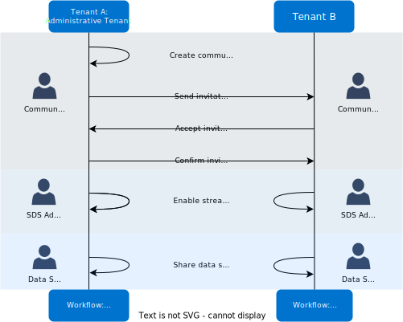

# Community setup

Establish a community by creating it and then inviting your trusted business partners to join from their tenant. Each invitation is a three-way handshake where one tenant sends an invitation, the invited tenant accepts, and then the original tenant confirms that the expected tenant accepted.

## Workflow: Community setup

Setup of a community involves coordination between two tenants and users with different user roles and permissions. Before you start setup of a community, review the figure below to better understand the entire community setup process.

**Workflow: Community setup**

This diagram lists each task that must be completed to form an operational community, broken down by each user role that performs them. Each of these tasks are documented in the upcoming sections:

- <xref:community-workflow-create>
- <xref:community-workflow-join>
- [Share streams](xref:community-manage-shared-streams#share-streams)

## Community user roles

To allow different tenants and users participating in a community to safely and securely share data streams with one another, AVEVA Data Hub includes several default user roles specifically for communities. These roles include granular permissions to allow different tenants and users to share specific data streams while keeping the remaining, unshared data streams private. When using Communities, you must assign the appropriate community roles to users that administrate or participate in the community. During community setup, you will need to assign different users with these roles.

- **Community Administrators**

	Community administrator permissions are required to perform administrative actions for the community within the scope of the tenant, such as community membership management.When a tenant creates or joins a new community, they are prompted to assign new community administration permissions to one or more existing roles. All users from your tenant that are assigned these roles inherit administrative permissions within the community. By default, the **Community Administrators** and **Tenant Administrator** roles have these permissions.

- **SDS Administrator**

	Communities require a user with privileges to allow other users to share streams within Sequential Data Store (SDS) explorer, such as the Tenant Administrator. Although the SDS Administrative user is not technically a community role, they are important during community setup because they grant different data stewards permissions to share streams into a community. Communities require a role with **manage permissions** access within SDS explorer to share streams. By default, the **Tenant Administrator** is an SDS administrative user and can manage stream permissions for other roles.

- **Tenant Data Stewards**

	Users that have permissions to share a data stream into a community are known as _Tenant Data Stewards_. Share permissions are required to share a stream into a community. Additionally, the user must be a **Community Member**. AVEVA recommends that you assign share permissions to the **Tenant Data Steward** role, but you can use any role that you want. 

- **Community Member**

	The Community Member role is a role that can be shared among multiple tenants participating in a community. This role is authorized to read any data shared in the community. Users assigned the Community Member role have read permissions within the community by default.

	By default, the **Tenant Data Steward** role has the Share permissions on all new streams.  If you want to have different data steward roles for different sets of streams, it is recommended that you do not place any users in the Tenant Data Steward role and create additional data steward roles that are given Share privileges for different groupings of streams—for example, Site A Data Steward and Site B Data Steward. You can configure default permissions by [managing default permissions for new streams](xref:streams-manage-stream-permissions#to-manage-default-permissions-for-new-streams).  

- **Administrative Tenant**

	Each community has an administrative tenant, which is the tenant that administers the community itself. When you create a new community, your tenant is automatically configured as the administrative tenant. Users assigned community administrator permissions on the administrative tenant have additional permissions for managing the community itself that affect all tenants within it.

## Next steps

Depending on whether you are creating or joining a community, proceed to one of the following topics:

- To create a community, see <xref:community-workflow-create>.
- To join a community, see <xref:community-workflow-join>.
