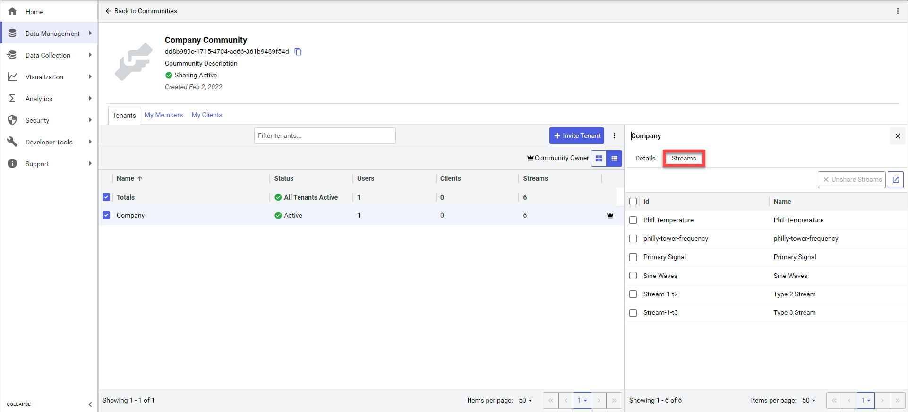
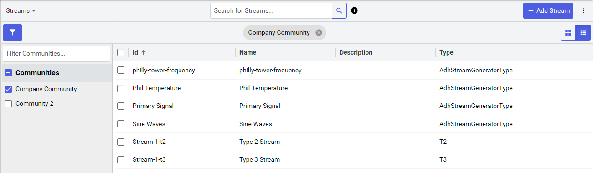
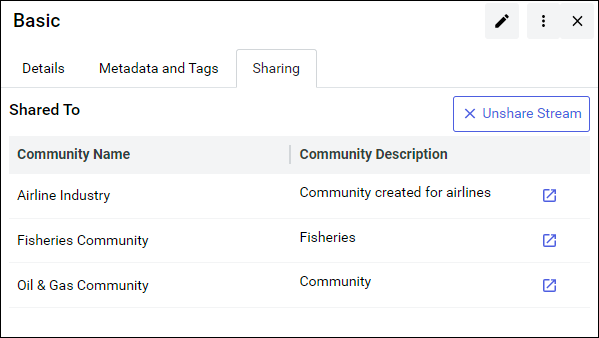

# View shared streams 

After a community has been established, you can view which data streams in your tenant have been shared into a community. You can view which data streams are shared in one of two ways: from the `Communities` page or `Sequential Data Store`. Your access to view information depends upon your assigned user roles and permissions.

## To view shared streams

You can view shared streams from both the `Communities` page and `Sequential Data Store`. Select one of the tabs for more information on how to view which data streams are shared.

## [Communities](#tab/communities)

From the `Communities` page **Tenants** tab, you can view which data streams each tenant has shared with the community.

1. From the left panel, select **Data Management** > **Communities**.

1. Browse to the applicable community and select **Details**.
    
1. From the **Tenants** tab, select a tenant to view which streams that it shares with the community.

    Details for the community open in the right pane.

1. From the right pane, select the **Streams** tab.
    
    

    The **Streams** tab lists each data stream that the tenant shares with the community. 

    **Tip:** Want to view more details about one of the shared streams? Select the **Launch** icon  to open it within `Sequential Data Store`.

## [Sequential Data Store](#tab/sds)

When working from `Sequential Data Store`, you can view which data streams are shared within communities, sorting by either stream or community.

### View shared streams by community

1. From the left panel, select **Data Management** > **Sequential Data Store**.

1. If necessary, enable the **Filter Communities** panel by selecting the **Filter** icon .

1. Select a community to filter for.

    

    The page is filtered to list only data streams shared in the selected communities.

### View communities for a shared stream

While viewing individual data streams in `Sequential Data Store`, you can view each community that the stream is shared with.

1. From the left panel, select **Data Management** > **Sequential Data Store**.

1. (Optional) Select one or more community to filter for.

1. Select a single data stream. Details for the community open in the right pane.

1. From the right pane, select the **Sharing** tab.

    

    The communities that the stream is shared to are listed. 

    **Tips:** Want to view a community that the selected stream is shared to? Select the **Launch** icon  for the community.

***
