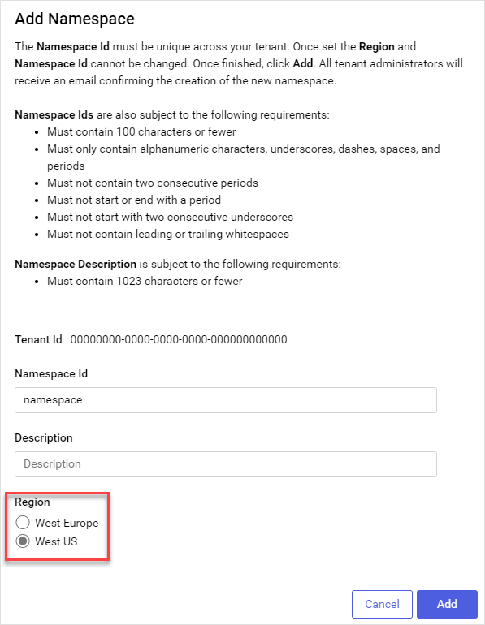

# Cross-region data sharing

By default, AVEVA Data Hub processes operational data from your tenant's namespaces and communities in geographical regions other than the originally chosen geographical region. AVEVA Data Hub shares this data for the following purposes:

- Performance optimization 
- Enabling users to search and access data that may be stored across regions

For example, if you have a namespace in AVEVA Data Hub that stores operational data in the `US-West` region, AVEVA Data Hub may process that data in the `EU-West` region, as depicted below.

## Cross region data sharing scenarios

Cross-region data sharing is enabled by default. When cross-region data sharing is enabled, AVEVA Data Hub may share operational data for a namespace across regions under the following circumstances.

### Additional processing

Each namespace in AVEVA Data Hub is bound to a geographical region. Operational data stored in each namespace is usually processed within that region, which is chosen while [adding the namespace](xref:gpNamespaces), as depicted below.

**Geographical region chosen during namespace creation**

However, AVEVA Data Hub may process a namespace's operational data in a different region (in other words, _cross-region_). For example, if you create a namespace in the `US-West` region, AVEVA Data Hub may process its operational data cross-region in `EU-West`.

Processing operational data usually involves reshaping it. In these instances where operational data is processed cross-region, data from your region may reside in the cross-region processing service memory up to several hours. 

### Data augmentation

In use cases where your operational data is stored within both the chosen region and cross-region, AVEVA Data Hub may process data from the chosen region in a different region. AVEVA Data Hub then adds and processes additional operational data from the cross-region before it displays in your browser session. In these instances, your data from both regions resides in the cross-region processing service memory up to several hours.

### Temporary storage

In some instances where AVEVA Data Hub sends operational data stored in your namespace's region for processing or data augmentation cross-region, AVEVA Data Hub may temporarily persist data from your region across regions before it is processed. This temporary storage is used for performance optimization. In these instances, data from your region persists in the cross-region processing service storage and memory up to several hours.

## Opt out of cross-region data sharing

Optionally, you can opt out of sharing operational data from namespaces and communities across regions. If you opt out of cross-region data sharing, your operational data is not processed or stored outside of the namespace's assigned region.

### To opt out of cross-region data sharing for namespace

When you disable cross-region data sharing, any queries for namespace data are routed to the appropriate region for complete results to be returned. Repeat these steps for each namespace that you want to disable cross-region data sharing.

1. From the **Namespace** drop-down, select a namespace for which you want to opt out of cross-region data sharing. 

1. From the **Namespace** drop-down, select the **Cog** .

1. Select the **Data Sharing** tab.

1. Select **Edit**.

1. Enable **Opt-out for Namespace** and select **Save**.

	**Important!** If you opt out of cross-region data sharing for a namespace that includes streams shared with a community, you should also update the community preferred region setting. Using this setting, you can override the default region to explicitly choose where operational data is processed. For more information, see <xref:community-manage-preferred-region>.