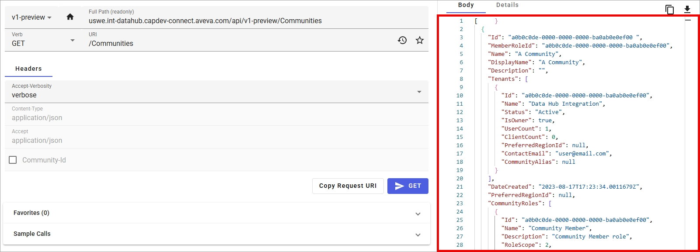
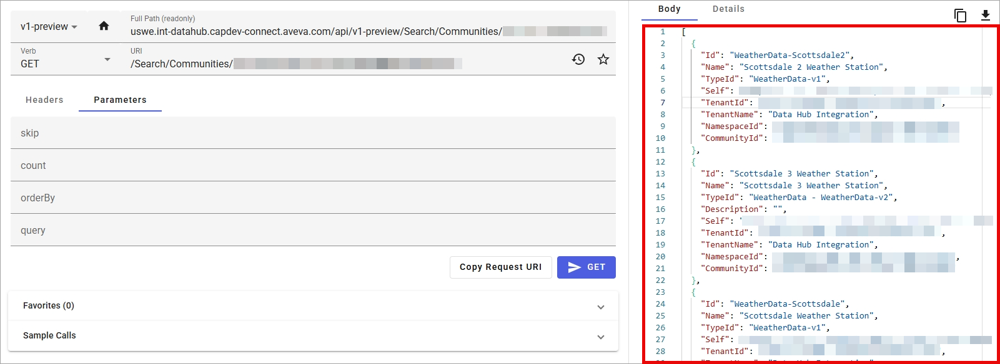
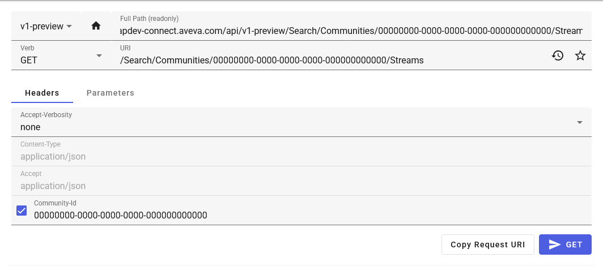
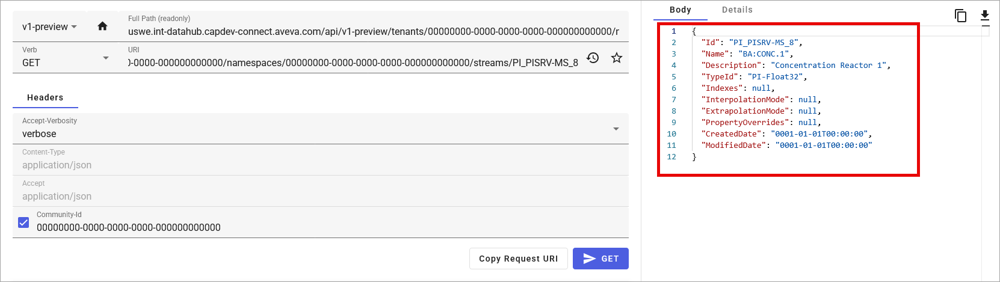
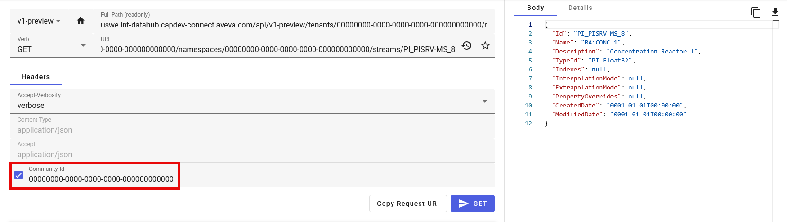

# Read community data

You can use APIs to read community data shared with your tenant. The steps are:

1. Connect to CONNECT data services with a role that has access to communities.

1. Using the [List Communities a Tenant is Joined to](../api-reference/identity/communities.md#list-communities-a-tenant-is-joined-to) endpoint, query for the list of communities to which your tenant is connected.

   

1. (Optional) Using the [Get a Community by Id](../api-reference/identity/communities.md#get-a-community-by-id) endpoint, retrieve a community's information using the community `Id`.

1. Using the [List Streams By Community](xref:community-search#list-streams-by-community) endpoint, query for streams using a community `Id` (like one obtained in the previous step).

   

1. From the same endpoint path, use the `Self` link in the response to get to the stream. Enter the community `Id` in the `Community-Id` header parameter.

   

   **Note**: This is the easiest method, because it contains region information, but the tenant and namespace information needed for the stream URL are included as other properties.

   See [Definitions](xref:community-search#definitions) and [Get Stream](xref:sds-streams#get-stream).

1. Use the resolved route with the `Community-Id` in the header to get Type information; types can not be accessed directly. See [Get Resolved Stream](xref:sds-streams#get-resolved-stream).

   

1. Use data calls as normal, including the header `Community-Id` parameter. See <xref:sds-stream-data>.

   
