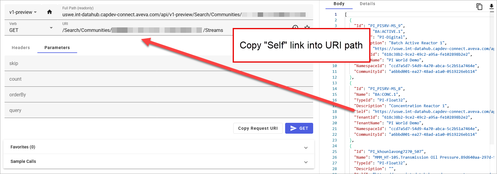

# Read community data

You can use APIs to read community data shared with your tenant. The steps are:

1. Connect to CONNECT data services with a role that has access to communities.

1. From the navigation menu, select **Developer Tools** > **API Console**. Verify that:

     - The **Change the targeted API version** dropdown is set to **v1-preview** or later.
     - Root path is enabled (disable the **Home**  icon).

1. From the **URI** field, set the URI to the  [List Communities a Tenant is Joined to](../api-reference/identity/communities.md#list-communities-a-tenant-is-joined-to) endpoint, and then query for the list of communities that your tenant is connected to.

   **Tenant community memberships**
   

1. (Optional) Using the [Get a Community by Id](../api-reference/identity/communities.md#get-a-community-by-id) endpoint, retrieve a community's information using the community `Id`.

1. Using the [List Streams By Community](xref:community-search#list-streams-by-community) endpoint, query for streams using a community `Id` (like one obtained in the previous two steps).

    **Community streams**
   

1. From the **Body** tab, copy the relevant stream's `Self` link and paste itinto the **URI** field.

   **Copy self link**
   

   **Note**: This is the easiest method, because it contains region information, but the tenant and namespace information needed for the stream URL are included as other properties.

   See [Definitions](xref:community-search#definitions) and [Get Stream](xref:sds-streams#get-stream).

1. Enter the community `Id` in the `Community-Id` header parameter.

   **Enter Community ID in header**
   

1. Use the resolved route with the `Community-Id` in the header to get type information; types can not be accessed directly. See [Get Resolved Stream](xref:sds-streams#get-resolved-stream).

   **Resolved community stream with type information**
   

1. Use data calls as normal, including the header `Community-Id` parameter. See <xref:sds-stream-data>.

   **Community ID included in normal data calls**
   
