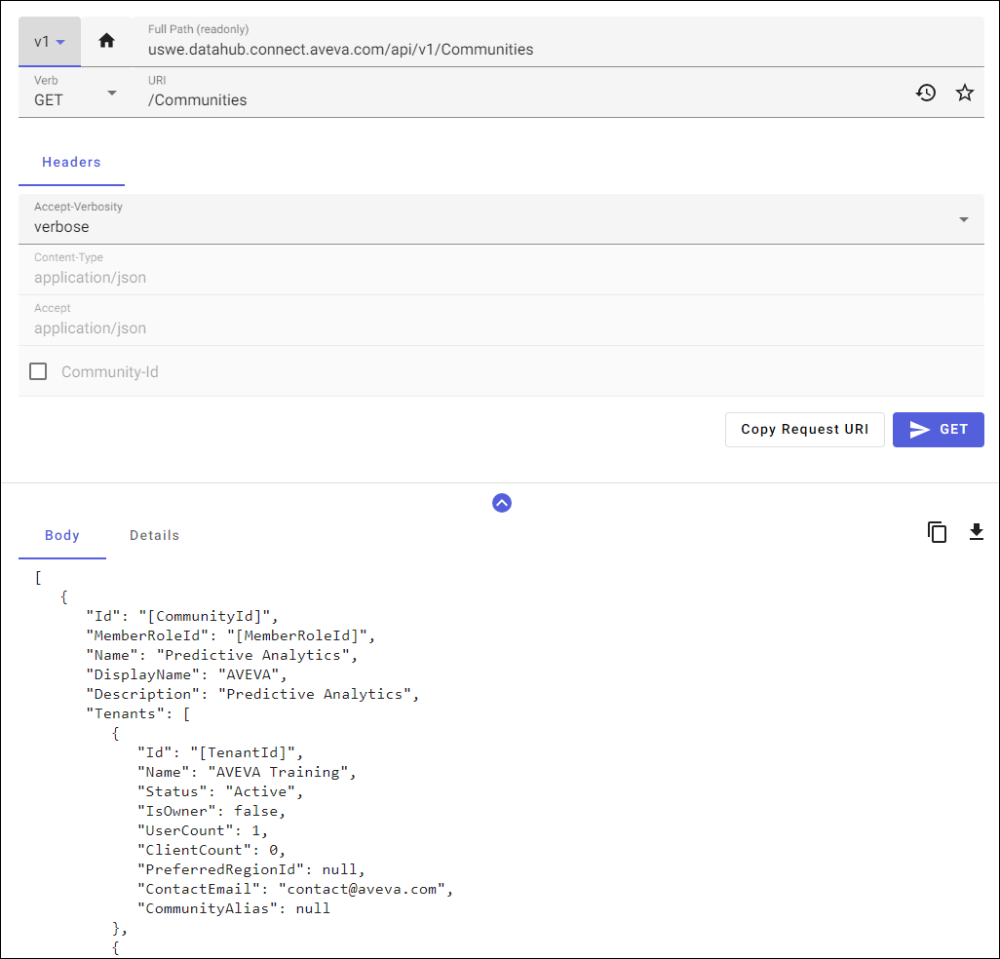
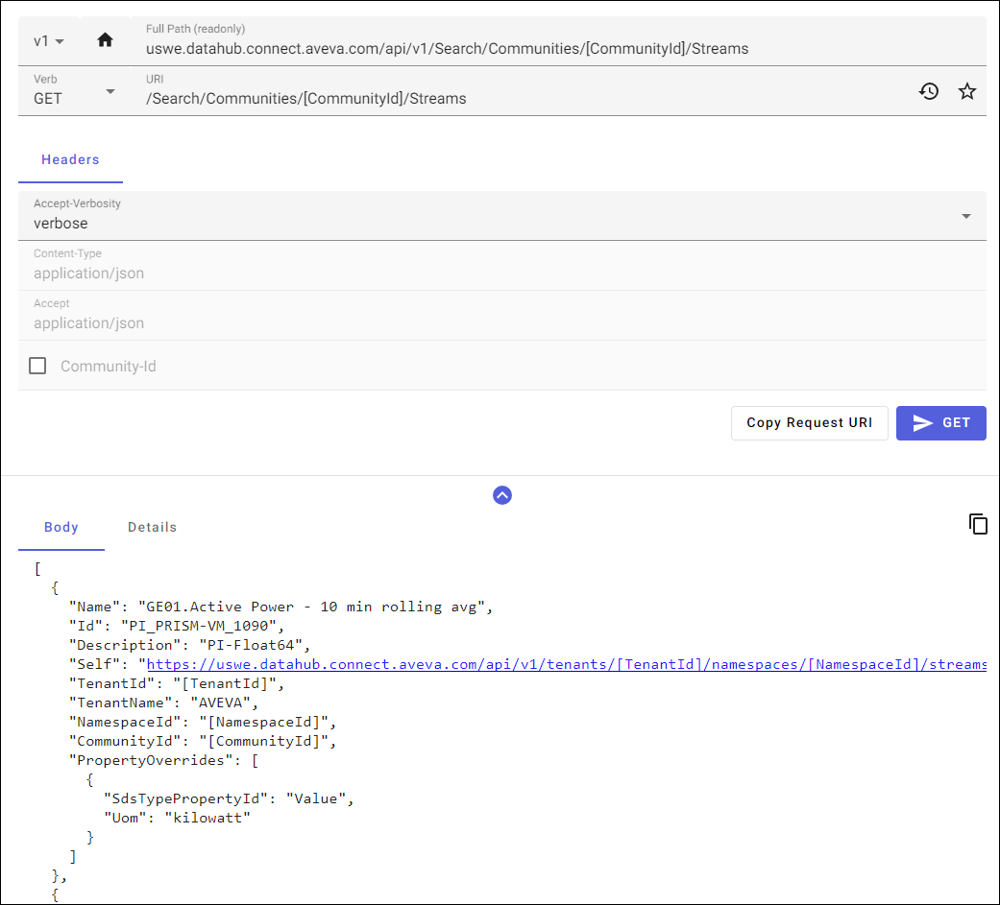

# Read Community data

You can use APIs to read community data shared with your tenant. The steps are as follows:

1. Connect to AVEVA Data Hub with a role that has access to communities.

1. Query for the list of communities to which your tenant is connected. See [List Communities a Tenant is Joined to](../api-reference/identity/communities.md#list-communities-a-tenant-is-joined-to).

   

1. (Optional) Retrieve a community's information using the communityId. See [Get a Community by Id](../api-reference/identity/communities.md#get-a-community-by-id).

1. Query the community for streams using the communityId. See [Search Streams By Community](xref:community-search#search-streams-by-community).

   

1. Use the `Self` link in the response to get to the stream, including the communityId in the header.

   **Note**: This is the easiest method, because it contains region information, but the tenant and namespace information needed for the stream URL are included as other properties.

   See [Definitions](xref:community-search#definitions) and [Get Stream](xref:sds-streams#get-stream).

1. Use the resolved route with the communityId in the header to get Type information; types can not be accessed directly. See [Get Resolved Stream](xref:sds-streams#get-resolved-stream).

1. Use data calls as normal, including the communityId in the header. See <xref:sds-stream-data>.

   
