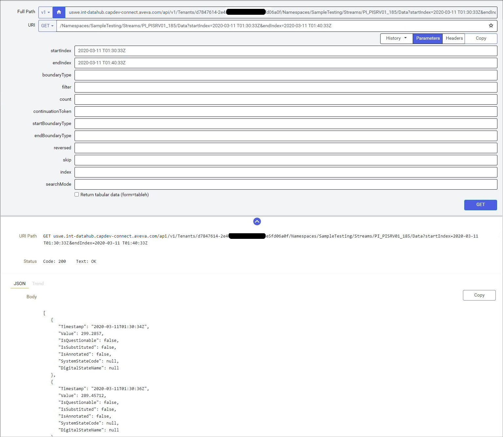
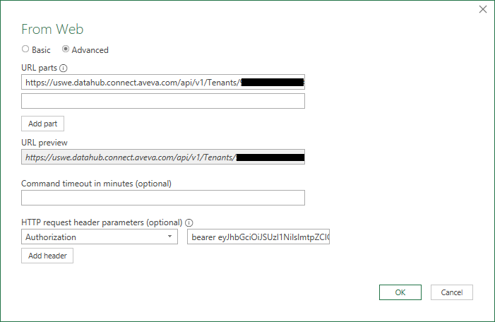
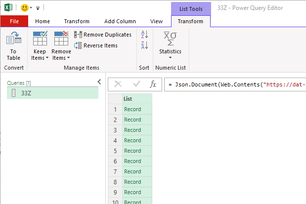
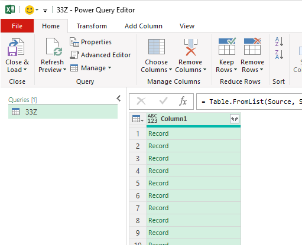
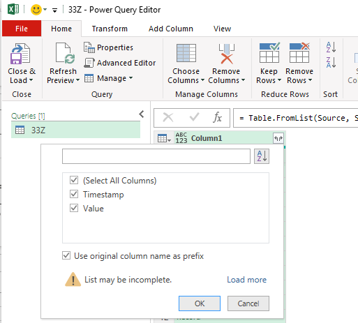

# Use Excel with OCS

You can use Microsoft Excel to import data from OCS. With Power Query (known as Get & Transform in Excel), you can connect to external data and then shape that data in ways that meet your needs. Then, you can load your query into Excel to create charts and reports.

The basic steps needed to use OCS with Excel are:

1. Create a client with a client ID and a secret that can generate bearer tokens with a configurable lifetime.

1. Use PowerShell to retrieve a bearer token by presenting the client ID and the secret.

1. Create an API request.

1. Use Excel Power Query to get data from OCS, supplying the query along with the bearer token. 

1. Transform the data in Power Query and load it into an Excel table.

These are the basics to get new Excel and OCS users up and running quickly. More advanced Excel users can automate parts of this process to retrieve and renew a bearer token if needed.

## Step 1 – Create a client

Clients allow applications to authenticate against OCS from outside the OCS portal. The first thing that you must do is create a client to connect to OCS.

Create a client with any name and accepting the rest of the defaults including a Token Lifetime of 3600 seconds. Make note of the secret somewhere secure as there is no way to retrieve it. However, you can create multiple secrets for the same client Id or delete a client if needed. See <xref:gpClientCredentialsClient> for the steps. 

An existing client can be used, and many connections can be made through one client. All you need are the client Id and secret.

## Step 2 – Retrieve the token

The token is the pass you use to connect to OCS, send requests, and get responses. It is passed with every request you send.

Use the following PowerShell example to write a small app to retrieve a token. Substitute your client Id and secret for `XXX` and `YYY` in the first two lines:

```PowerShell
$clientId = 'XXX'
$clientSecret = 'YYY'
$body = @{
    grant_type='client_credentials'
    client_id=$clientId
    client_secret=$clientSecret
    }
$contentType = 'application/x-www-form-urlencoded'
$token = (Invoke-WebRequest -UseBasicParsing –Uri "https://dat-b.osisoft.com/identity/connect/token" -Method post -body $body -ContentType $contentType).content|Convertfrom-Json|select access_token
write-host $token
```

This code sends a request along with your client Id and secret to an endpoint and receives a bearer token in return. The last line writes the contents of `$token` to the screen as `@access_token=<ACCESS_TOKEN>`. Everything to the right of the `=` sign is your bearer token, which by default allows you to send and receive data for 3600 seconds. You need this entire token for the next step.

## Step 3 – Create an API request

Build an API request in the API console. See <xref:apiConsole>.

The example below gets data from one stream over the period covered from **startIndex** to **endIndex**, in this case ten minutes on 11-Mar-2020 from a stream called `PI_PISRV01_185`.



## Step 4 – Use Excel Power Query to get data from OCS

1. Launch Excel and create a new workbook.

1. From the ribbon, select **Data** > **Get & Transform Data** > **From Web**.

1. Select **Advanced**.

1. Put your API request in the **URL parts** field, prepended with "https://".

1. Under **HTTP request header parameters** add an **Authorization** type with the value of "bearer" followed by the bearer token.

   

1. Select **OK** and the results are loaded into the Power Query Editor as a JSON object.

   

## Step 5 – Transform the data

1. Depending on the structure of your stream type, you may need to transform the JSON object to a table using **Convert** > **To Table**.

   

1. Select the split button in the column header to split the JSON records apart into an Excel table and select **OK**.

   

   The stream data appears as a table.

1. Select **Close & Load** to close Power Query and load the data into Excel, properly formatted as a table.
