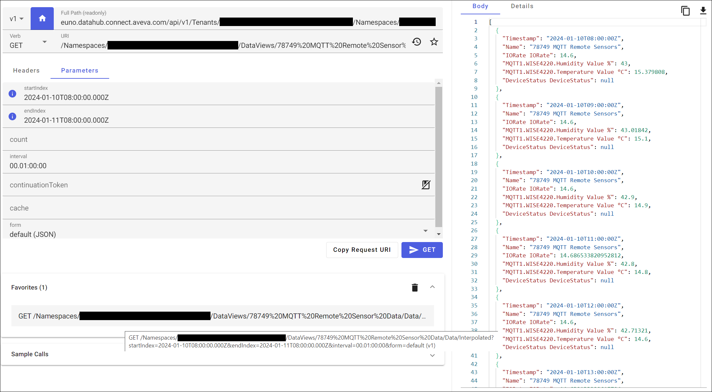
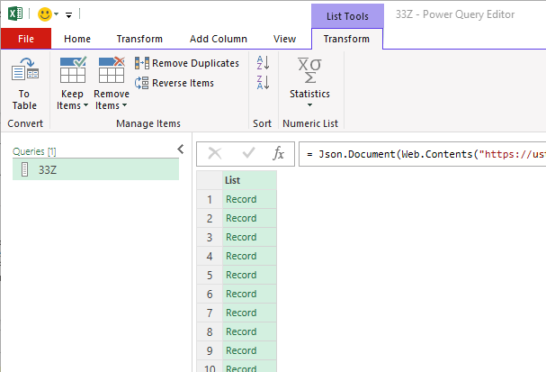

# Use Excel with CONNECT data services

You can use Microsoft Excel to import data from CONNECT data services. With Power Query (known as Get & Transform in Excel), you can connect to external data and then shape that data in ways that meet your needs. Then, you can load your query into Excel to create charts and reports.

The basic steps needed to use CONNECT data services with Excel are:

- Step 1 – Create a client

   Create a client with a client ID and a secret that can generate bearer tokens with a configurable lifetime.

- Step 2 – Retrieve the token

   Use PowerShell to retrieve a bearer token by presenting the client ID and the secret.

- Step 3 – Create an API request

   Create an API request using the API console in CONNECT data services.

- Step 4 – Use Excel Power Query to get data from CONNECT data services

   Use Excel Power Query to get data from CONNECT data services, supplying the query along with the bearer token. 

- Step 5 – Transform the data

   Transform the data in Power Query and load it into an Excel table.

These are the basics to get new Excel and CONNECT data services users up and running quickly. More advanced Excel users can automate parts of this process to retrieve and renew a bearer token if needed.

## Step 1 – Create a client

Clients allow applications to authenticate against CONNECT data services from outside the portal. The first thing that you must do is create a client to connect to CONNECT data services.

Create a client with any name and accept the rest of the defaults including a Token Lifetime of 3600 seconds. Make note of the secret somewhere secure as there is no way to retrieve it. However, you can create multiple secrets for the same client Id or delete a client if needed.

An existing client can be used, and many connections can be made through one client. All you need are the client Id and secret.

## Step 2 – Retrieve the token

The token is the pass you use to connect to CONNECT data services, send requests, and get responses. It is passed with every request you send.

Use the following PowerShell example to write a small app to retrieve a token. Substitute your client Id and secret for `XXX` and `YYY` in the first two lines:

```PowerShell
$clientId = 'XXX'
$clientSecret = 'YYY'
$body = @{
    grant_type='client_credentials'
    client_id=$clientId
    client_secret=$clientSecret
    }
$contentType = 'application/x-www-form-urlencoded'
$token = ((Invoke-WebRequest -UseBasicParsing -Uri "https://euno.datahub.connect.aveva.com/identity/connect/token" -Method post -body $Body -ContentType $contentType).content | Convertfrom-Json).access_token
Write-Host $token
Set-Clipboard -Value $token
```

This code sends a request along with your client Id and secret to an endpoint and receives a bearer token in return. The `Write-Host $token` command displays the full text of the bearer token that you have received. You will need that entire token for step four. To help with this, the `Set-Clipboard -Value $token` command copies that full token text to your clipboard, so that you may easily use it later.

## Step 3 – Create an API request

Build an API request in the [API console](xref:apiConsole), such as one that returns interpolated JSON data for a Data View. See [Use the API Console to retrieve your data view](https://docs.aveva.com/bundle/aveva-data-hub/page/1263302.html#_tip_use_the_api_console_to_retrieve_your_data_view).



## Step 4 – Use Excel Power Query to get data from CONNECT data services

1. Launch Excel and create a new workbook.

1. From the ribbon, select **Data** > **Get & Transform Data** > **From Web**.

1. Select **Advanced**.

1. Put your API request in the **URL parts** field, prepended with "https://".

1. Under **HTTP request header parameters** add an **Authorization** type with the value of "bearer" followed by the bearer token.

   

1. Select **OK** and the results are loaded into the Power Query Editor as a JSON object.

   

## Step 5 – Transform the data

1. Depending on the structure of your stream type, you may need to transform the JSON object to a table using **Convert** > **To Table**.

   

1. Select the split button  in the column header to split the JSON records apart into an Excel table and select **OK**.

   

   The stream data appears as a table.

1. Select **Close & Load** to close Power Query and load the data into Excel, properly formatted as a table.
