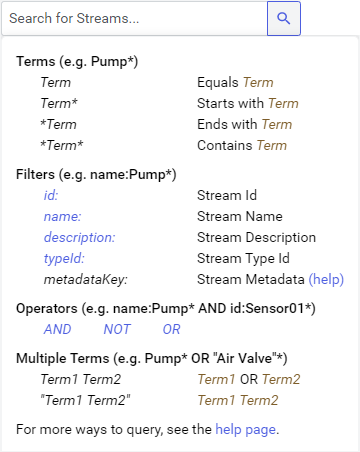
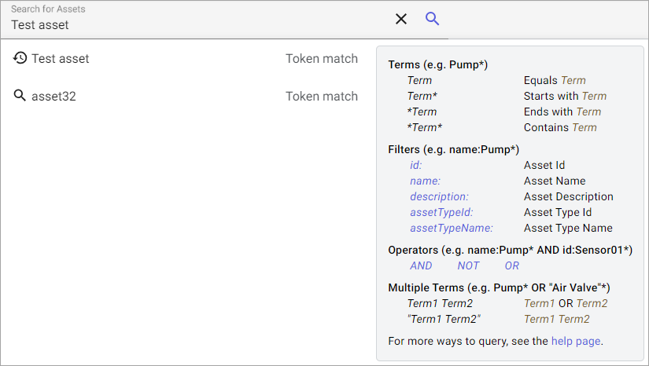

# Search

Many pages in OSIsoft Cloud Services (OCS) include a search or query bar to help find streams, assets, or other objects. This page offers tips and best practices for using search.

## Tooltip

Some **Search** and **Query** bars include a tooltip that opens when you select the bar. This tooltip includes information on how use search features like wildcards, filters, and operators.

**Search tooltip**

### Terms

When searching for terms, use the wildcard operator (`*`) as a stand-in for a character string. For example, searching for `mi*` returns both "Minnesota" and "Mitsubishi".

Examples:

| Search term | Results |
|--|--|
| `Term*` | Starts with `Term` |
| `*Term` | Ends with `Term` |
| `*Term*` | Contains `Term` |

### Filters

You can filter for specific data objects by prefacing your search with a metadata property key, followed by a specific value that you are searching for. You can filter using the following properties:

| Property | Description |
|--|--|
| `id` | stream/asset Id |
| `name` | stream/asset name |
| `description` | stream/asset description |
| `type` (streams only) | stream type Id |

**Tip:** You can use the wildcard operator (`*`) in conjunction with filters. 

### Operators

Use operators to combine search terms. Available operators include:

- AND
- NOT
- OR

**Example:** name:Pump* AND id:Sensor01*

## Autocomplete

Autocomplete suggests useful search tokens or phrases as you type in a search field. Autocomplete complements the search experience by:

- Enhancing the search experience for users who may not know the available keywords.

- Preventing typos and reducing the need for wildcards, which can result in more complex queries.

Autocomplete includes two types: Token autocomplete and faceted autocomplete.

**Search autocomplete**

### Token Autocomplete

Token autocomplete suggestions consist of a single token and an occurrence count. Tokens available for autocomplete include all tokens that appear in properties with a searchable attribute.

Suggestions are ranked by each token's occurrence count, which is the number of times that the token occurs in completable properties across all objects. 

For example, if "Minnesota" appears 200 times across objects in the index and "Mitsubishi" appears 100 times, a query `mi` would result in "Minnesota" being weighted higher and appearing first.

### Faceted Autocomplete

Faceted autocomplete suggestions consist of a collection of matching phrases, each with a list of categories and a object count for each category.

The categories are the name of the property for properties comprising of simple types (Int32, DateTime, etc.) and collections of simple types (static facets). For collections of key-value pairs, the keys represent categories and the values represent phrases.

Suggestions are ranked by the phrase's object count. In other words, the phrase that appears in the most number of objects ranks first in the results.

## Developer documentation

See the following topics in for full details about search and the properties that you can search for:

- <xref:asset-search-dev-guide>: Information on searchable properties while using the Asset Store.

- <xref:sdsSearching>: Information on searchable properties while using the Sequential Data Store.

**Note:** You can use the search information above to search for data objects when editing data view queries as well.
