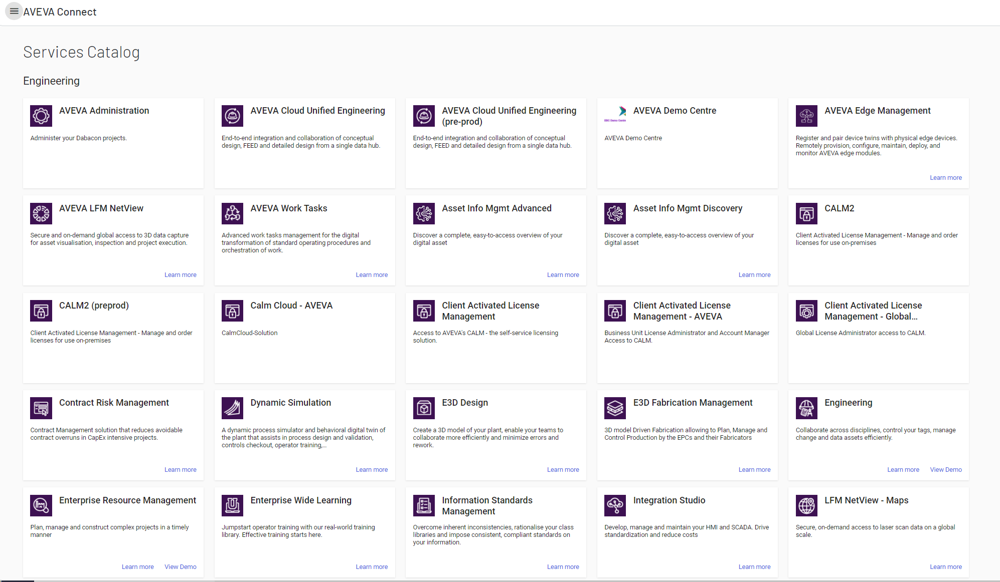

# AVEVA Cloud Services Catalog

AVEVA Data Hub is one of the services available on AVEVA Connect. All AVEVA Connect services are listed in the Services Catalog in the AVEVA Connect portal. You can use this service catalog to see all the services your organization has subscribed to and also discover other AVEVA services.

## AVEVA Connect services

The AVEVA Connect home page lists all the services you have access to as a set of tiles. To be viewed as a tile on the home page, each service must be subscribed to in the AVEVA Cloud Services Catalog and turned on in a folder in AVEVA Connect. Click anywhere on the appropriate tile to launch the service you wish to use.

## Navigate to the Services Catalog

The Services Catalog is accessed from the AVEVA Connect home page.

1. From the AVEVA Connect home page, click the menu icon, then select **Services Catalog**.
 
   **Result:** The **Services Catalog** page opens.

    

    **Note:** **SUBSCRIBED** appears on service tiles that your organization has access to use. 

1. Click **Learn more** on a tile to view information about that service.
 
## View service status

AVEVA maintains the following real-time status dashboard, where you can get updates on the status and system health of its cloud offerings: https://status.connect.aveva.com/.

AVEVA uses this dashboard to publish notifications for scheduled maintenance updates to solutions, and if there are any interruptions to service, provides an initial status along with regular updates until the service returns to normal. You can subscribe to relevant alerts to be notified of postings as they are made.   
