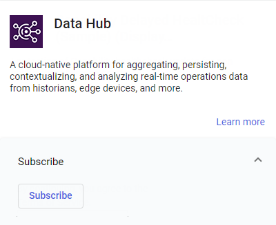

# Step 1B: Subscribe to AVEVA Data Hub

Before your organization can use AVEVA Data Hub, you must first subscribe to the AVEVA Data Hub service within AVEVA Connect. You must be an AVEVA Connect administrator to complete the subscription process.

**Note:**  If you have any questions or issues related to this procedure, contact [AVEVA customer support](https://softwaresupport.aveva.com).

1. From the AVEVA Connect home page, select  > **Services Catalog**.

1. Scroll to **AVEVA Data Hub**. Select **Subscribe**.

    

   The AVEVA Data Hub service subscription is enabled for your organization.

   **No option to subscribe?** Contact your AVEVA Account Manager.
