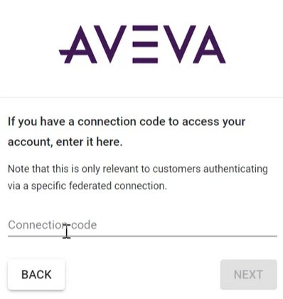

# Sign in to AVEVA Connect and navigate to AVEVA Data Hub 

This topic explains how to navigate to AVEVA Data Hub via [AVEVA Connect](https://connect.aveva.com/) for the following types of accounts:

* Corporate sign-in: federation for single sign-on

* Single user sign-in

* Third-party user access

## Corporate sign-in: federation for single sign-on

Some AVEVA Connect accounts use Active Directory Federation Services (AD FS), which enables authentication and authorization to AVEVA Connect applications using the corporate user identity. This enables you to use single sign-on with the user account from the corporate domain.

To sign-in with single sign-on:

1. Open the [AVEVA Connect page](https://connect.aveva.com/). 

   **Note:** If single sign-on is enabled, you only need to provide your email address when signing in to AVEVA Connect. You may be prompted to sign into your corporate Sign-In page.

1. From the AVEVA Connect home page, select the folder that represents your organization's services.
   
   The available applications for this namespace account appear. 
     
1. Select the AVEVA Data Hub tile.

   The AVEVA Data Hub portal opens. 

## Single user sign-in

To sign in as a single user:

1. Open the [AVEVA Connect page](https://connect.aveva.com/). 

1. Sign in with your credentials. 
    
    The AVEVA Connect home page is displayed.

    **Note:** If you attempt a sign-in ten times consecutively with a wrong password from the same location (IP address), then your login will be blocked. If this happens, contact [AVEVA Customer Support](https://softwaresupport.aveva.com) to unlock your account.

1. From the AVEVA Connect home page, select the folder that represents your organization's services.
   
   The applications available from this namespace account are displayed below the folder. 
     
1. Select AVEVA Data Hub tile.

   The AVEVA Data Hub portal opens. 

## Third-party user access

A connection code enables third-party users to access specific accounts associated with an Identity Provider. Any accounts that are not intended for the third-party user are hidden.

**Note:** You must have a federated connection.

To sign in as a third-party user using a connection code:

1.	On the AVEVA Connect login page, enter your email address.

1.	Select **Have a connection code?**.

    

1.	Enter your connection code. This is provided by AVEVA.
 
    **Note:** A direct sign-in link can be provided to enable quick access to restricted accounts. The third-party user will receive an email invitation that contains the direct link.

1.	Select **Next**.

1.	Select the desired account.

    The AVEVA Connect home page displays for the selected account.

1. From the AVEVA Connect home page, select the folder that represents your organization's services.
   
   The applications available from this namespace account display below the folder. 
     
1. Select the AVEVA Data Hub tile.

   The AVEVA Data Hub portal opens.
