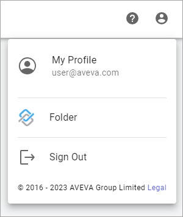
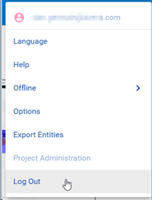

## Sign out of AVEVA Connect

Some AVEVA Connect application environments are independent of each other. To switch between application environments you should sign out before attempting to sign in to another application.

When you have completed your session within AVEVA Connect, you must sign out. To do this, click the profile icon (top-right) in AVEVA Connect, and then click **Sign Out**. 

 
Within an application, the log out process is similar. 

