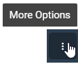

# Get started with asset types

An asset type is a template for creating assets that share a common structure or type. For more information about asset types, see the following topics:

- [Asset types](xref:AssetTypes)

- [PI Server counterpart](xref:AssetTypes#pi-server-counterpart)

- [Asset types best practices](xref:AssetTypes#asset-types-best-practices)

You can create an asset type in one of the following ways:

- [Create an asset type from the beginning](#create-an-asset-type-with-the-asset-explorer) 

- [Convert an existing asset to an asset type](#create-an-asset-type-from-an-asset)

## Create an asset type with the asset explorer

Follow the procedure to use the asset explorer to create an asset type.

1. In the left pane, select **Visualization** > **Asset Explorer**.

1. Click the **Change Namespace** button in the upper-right toolbar, then select **MyData**.

1. From the **Asset/Asset Types Selector** list, select **Asset Types**.

1. In the menu bar, click **Add Asset Type** to open a panel on the right side.

1. In the new asset type panel, enter the following:

   - **Asset Type** &ndash; *MyData.PumpType*

   - **Description** &ndash; (Optional) Add a description for the asset. By default, this description is inherited by assets created with this asset type, but it can be overwritten on the individual assets.
   
1. Click the **Metadata** tab, and then click **Add Metadata**.

1. Enter the following metadata values:

   - **Metadata** &ndash; *Maximum Flow Rate*

   - **Value** &ndash; *2* 

   - **Type** &ndash; *Double*

   - **UOM** &ndash; *US gallon per minute (Volume Flow rate)*
   
1. Click the **Properties** tab, and click **Add Stream Type Reference**.

1. In the `Select Stream Type` window, click **MyData.PumpState** in the list, and then click **Add**.

1. Click the **Status** tab, and click **Add Status Configuration**.

    The `Select Property` window opens with a list of properties that can be represented as a status. For a property to be configured as a status, the property must be an enumerated state. Click **Cancel** to exit the window.
    
1. When you are finished adding Metadata, Properties, and Status to the asset type, click **Save**. 

    The asset type is added to the asset type list on the left.
    
1. In the asset type pane, use the icons in the upper right of the toolbar to switch between the following:

     -   &ndash; Card view displays the asset types as a series of tiles. 
     -   &ndash; Table view displays the asset types in a table format.
     -   &ndash; Autorefresh checks for updates and refreshes the screen with new results. 

## Create an asset type from an asset

You can take an existing asset and use it as the basis for creating an asset type.

1. In the left pane, select **Visualization** > **Asset Explorer**.
 
1. Click the **Change Namespace** button in the upper-right toolbar, then select **MyData**.

1. Select the **MyData.Asset** asset.

   **Note:** In the upper-right corner of the right pane, **Asset Type** is set to *< None >* indicating that this asset is not based on an asset type. 

1. Click the  icon, then click **Save as Asset Type**.

1. In the `Create an Asset Type for MyData.Asset` window, enter the following:
   
   - `Name` &ndash; **MyData.TankType**
   - `Description` &ndash; (Optional) Add a description for the asset type. By default, this description is inherited by assets created with this asset type, but it can be overwritten on the individual assets.

1. Click **Create**. 

   The MyData.TankType asset type is added to the asset type list. Note that the **Asset Type** for the MyData.Asset asset is now set to `MyData.TankType`. 

## Next step

Continue with [Get started with metadata rules](xref:gsMetadataRules).
