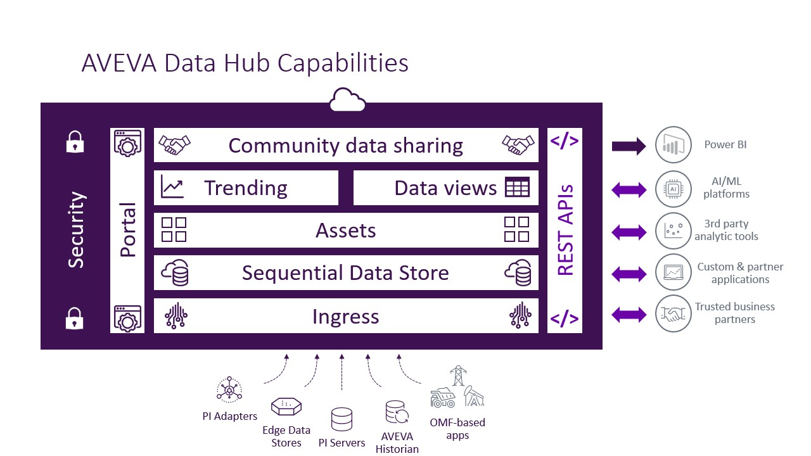

# Get started

Welcome to AVEVA Data Hub! This Get Started guide walks you through initial setup and configuration of the AVEVA Data Hub platform. Then it provides an overview of some of the major capabilities available for the platform. It is not a comprehensive guide for all available features.

Because AVEVA Data Hub sits on top of the AVEVA Connect platform, setup and configuration of AVEVA Data Hub also requires use of AVEVA Connect. Therefore, this Get Started guide refers to various help topics in both the AVEVA Data Hub and AVEVA Connect documentation.

The following image displays each feature available in AVEVA Data Hub. The topics listed below describe the features, functionality, and implementation of the features depicted in the image.

Complete the following major steps to get up and running in AVEVA Data Hub.

1. <xref:gs-setup-connect>
1. <xref:gs-setup-connect-users>
1. <xref:gs-setup-data-hub-users>
1. <xref:gs-ingress>
1. <xref:gs-data-management>
1. <xref:gs-egress>

**Tip:** Use the [Workflow map](https://aveva-dev.zoominsoftware.io/category/adh-get-started) for a visual walkthrough of getting started.
