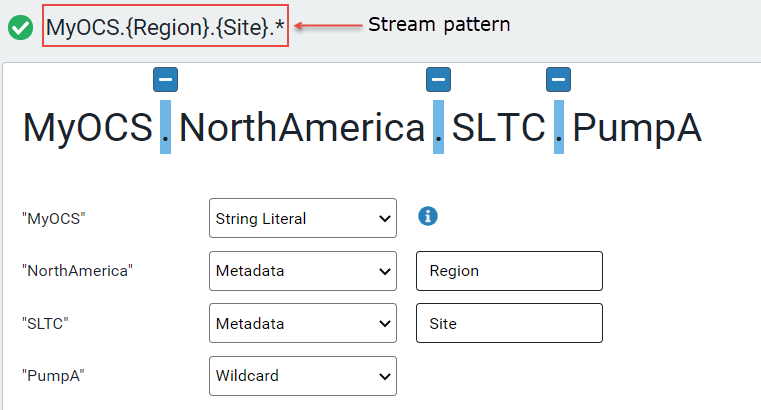

# Get started with metadata rules

Metadata rules allow you to add metadata to streams. For more information about metadata rules and how to use them effectively, refer to the following topics:

- [Metadata rules](xref:ccMetadataRules)

- [PI Server counterpart](xref:ccMetadataRules#pi-server-counterpart)

- [Metadata best practices](xref:ccMetadataRules#metadata-best-practices)

## Procedure

 The following are the main steps for creating a metadata rule and applying it to your streams. Click on each step to go to the procedure for that step. 

1. [Select a stream](#step-1)

2. [Create the pattern for the metadata rule](#step-2)

3. [Define metadata mappings](#step-3)

4. [Apply the rule and preview the results](#step-4)

<!-- Writer's Comment: You must link the steps above to the sections below using HTML anchors because Markdown does not permit colons in anchor names. -->

## Step 1: Select a stream

The first step is to identify and select a stream whose name will be the basis for creating the metadata rule.

1. In the left pane, select **Data Management** > **Metadata Management**.

1. Click the **Change Namespace** button in the upper-right toolbar, then select **MyOCS**.

1. Click **Add Metadata Rule**.

1. In the **Search** field, enter *MyOCS\**.

   The MyOCS.NorthAmerica.SLTC.PumpA stream is returned in the table.

1. Select **MyOCS.NorthAmerica.SLTC.PumpA** and click **Next**. 

## Step 2: Create the pattern for the metadata rule

In this step, you identify delimiters in the stream name. Delimiters include periods (.), underscores (_), and hyphens (-). For each stream name part, you specify the type of data it is, that is, whether it is metadata, string literal, or wildcard. These settings have implications for the search pattern.

1. Click the plus sign (+) above each of the three delimiters.

   **Note:** You can click on the minus sign (&ndash;) to ignore a delimiter.

1. In the first row, **"MyOCS"**, click the dropdown list and select **String Literal**.

   The string *MyOCS* will be used to match this part of the stream pattern. However, it is not mapped to metadata.

1. In the second row, **"NorthAmerica"**, accept the default **Metadata** setting, and enter *Region* as the key.

   **Note:** Metadata keys are mapped to values in Step 3: Define metadata mappings.

1. In the third row, **"SLTC"**, accept the default **Metadata** setting, and enter *Site* as the key.

1. In the fourth row, **"PumpA"**, click the dropdown list and select **Wildcard**.

   The wildcard means that streams with any values in this part of the stream name will match the pattern. However, this part of the stream name is not mapped to metadata.

   When you are done, the pattern looks like the following. The stream pattern defined in the table translates to MyOCS.{Region}.{Site}.* This stream pattern returns all streams that start with the string *MyOCS*, followed by three parts delimited with periods. The second part corresponds to the region and the third part corresponds to the site. *Region* and *Site* are metadata.

   
  
1. Click **Next**. 

## Step 3: Define metadata mappings

In this step, you define mappings. 

1. Select the **Region** key. This is selected by default.

   **Note:** You can change the metadata key name by editing the **Key** text box.

1. Select **Copy Values** for the **Mapping Type**.

   **Copy Values** copies the string contained in that part of the stream name and assigns it to the **Region** key.

1. Click **Site**.

1. Select **Map Values** for the **Mapping Type**.

   This option allows you to map the part of the stream name associated with the **Site** key to another value. You may either manually enter the mappings or generate the mappings from existing streams. 
  
    **Note:** If there is a value that does not match any of the mappings, it does not create metadata for that stream. This can be useful in the instance where there are two different metadata rules that have a similar naming pattern, for example:

   - MyOCS.{Region}.{Site}.*

   - MyOCS.{Location}.{Department}.*

     A stream (for example, MyOCS.WestCoast.Mfg.Inventory) can match both patterns, but the values, `WestCoast` and `Mfg`, are mapped for only one of the metadata rules, `MyOCS.{Location}.{Department}.\*`. Therefore, if you execute the `MyOCS.{Region}.{Site}.\*` rule, it will not generate metadata for the `MyOCS.WestCoast.Mfg.Inventory` stream.

1. To generate mappings from existing streams, click **Generate Mappings**.

   Any existing streams that match the pattern are found (in this example, the **MyOCS.{Region}.{Site}.*** pattern). For each stream that matches the pattern, it lists that part of the stream name, in this example, it lists the part that corresponds to the **Site** key.
   
1. In the **Map To** text box, enter **San Leandro**. 

1. You can create additional mappings for streams which are not yet stored in OCS but will be created later. Click **Add Mappings** to add another mapping.

   OCS searches and finds any existing streams that match the pattern (the **MyOCS.{Region}.{Site}.*** pattern). For each stream that matches the pattern, it lists that part of the stream name, and in this example, it lists the part that corresponds to the **Site** key.
   
1. In the **Map From** text box, enter **PHL**. 

1. In the **Map To** text box, enter **Philadelphia**.

   When you have finished defining the mappings for the metadata keys, a green check mark appears next to the keys.

1. Click **Next**.

## Step 4: Apply the rule and preview the results

Apply the metadata rule to the streams and review the results. 

1. Enter the following:

   - **Name** &ndash; *MyOCS.MetadataRule*
   - **Description** &ndash; (Optional) Enter a description for the metadata rule

   The table displays a list of streams to which this metadata rule will be applied, and the metadata keys and values that will be added to the streams. In this example, there is one stream, `MyOCS.NorthAmerica.SLTC.PumpA`. There are two metadata keys: the **Region** key with the value `NorthAmerica` and the **Site** key with the value `San Leandro`.

   <!-- I'd like to include a screen capture of this, but I'm not able to get to the preview page. I get an error: Failed to Load Preview There was an error loading the preview from the server This is due to a bug 216457.-->

1. (Optional) Click **Configure Stream Access** to determine which roles the metadata rule uses to access the streams. 

   **Note:** This can be used to limit the streams to which the metadata rule is applied.

1. When you are done, click **Save & Execute**.

   The stream metadata is created for the applicable streams. Once this is completed, examine the streams and verify that the metadata has been created. 
