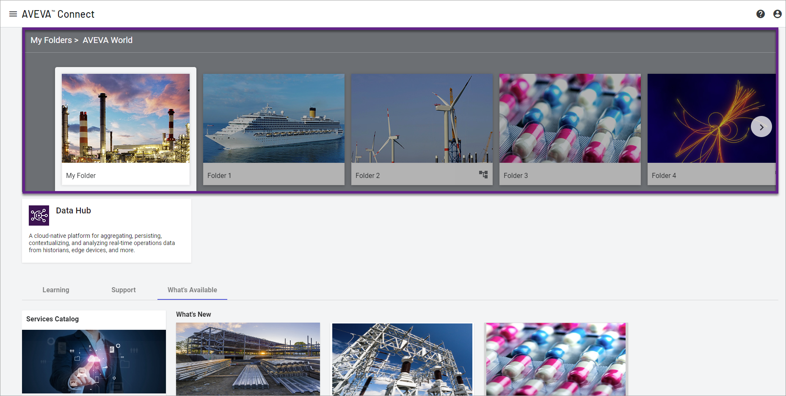
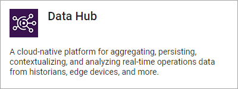

# Step 3A: Log into AVEVA Data Hub

Log into AVEVA Data Hub.

**Note:** These browsers are supported for the most recent three versions, unless otherwise stated: Microsoft Edge, Google Chrome, Mozilla Firefox

1. Open the [AVEVA Connect page](https://connect.aveva.com/).

   If single sign-on is enabled, you only need to provide your email address when signing in to AVEVA Connect. You may be prompted to sign into your corporate Sign-In page.

1. From the AVEVA Connect home page, select the folder that represents your organization's services.

    **Connect folders**

    

   The applications available from this namespace account are displayed below the folder.

1. Select the tile that represents AVEVA Data Hub.

    **Data Hub tile**

    

   The AVEVA Data Hub portal opens.
