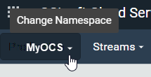
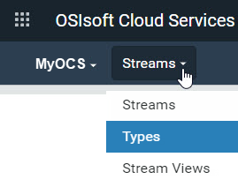

# Get started with streams

After creating your types, you can add streams and associate a type with the stream. For more information on streams, see the following topics:

- [Streams](xref:ccStreams)
- [PI Server counterpart](xref:ccStreams#streams-pi-server)
- [Streams best practices](xref:bpStreams)

## Procedure

1. Click the  and click **Sequential Data Store** (under Data Management).

1. Click the **Namespace** selection button to open the `Select a Namespace` window. Select the namespace in which you want to create the stream. 
    

1. From the **Streams** drop-down list, select **Streams** if it is not already selected. 
    

1. Click the  icon on the menu bar and click **Manage Default Permissions**.  
    The `Manage Default Permissions for New Streams` window opens. The default permissions for streams created in the selected namespace are configured here.
   
    **Note:** By default, you must be assigned the Tenant Administrator role to change the default permissions. Any changes only affect new streams. It does not change the permissions on already existing streams. 
    
    When you are done reviewing permissions, click **Cancel** to continue.
   
1. Click **Add Stream**.

1. In the `Add Stream` window, enter the following values for these fields:

   - `Id` &ndash; **MyOCS.NorthAmerica.SLTC.PumpA**
   - `Description` &ndash; **SDS Stream used by My OCS**
   - `Type` &ndash; **MyOCS.PumpState**

    **Note:** Leave the `Name` field blank. By default, it will take the value of the Stream Id.

1. Click the **Tags** tab, if it is not already selected.

1. In the `New Tag` field, type **OSIsoft**, and click **+** to add the tag. 

    **Note:** You can click the *X* to delete it from the stream.

1. Click the **Metadata** tab and click **Add Metadata**.

1. In the `Metadata Key` field,  enter **Site**, and in `Metadata Value`, enter **SLTC**. 

    **Note:** You can click the *X* to delete them from the stream. Once the stream is created, you can select the stream and click **Edit** to make changes to the tags and the metadata.

1. Click **Save**.

1. In the `Search` field, enter **Site:SLTC**

    OCS searches for streams that have the metadata key *Site* and the value *SLTC*. This search query returns the MyOCS stream. 
   
    **Note:** 
    
    - Use quotation marks around the value if there are spaces in the text.
    - You can also search by the Type Id.  If you enter **TypeId:MyOCS.PumpState**, it returns the  MyOCS.NorthAmerica.SLTC.PumpA stream.
    
1. Select the **MyOCS.NorthAmerica.SLTC.PumpA** stream and click **Manage Data**. 

    This allows you to run queries against the data in the stream and to add, edit, and remove events.

1. Click **Add Event**.

1. In the `Add Event` window, complete the following fields: 

    - `Status` &ndash; Enter **Running**. 
    - `Pressure` &ndash; Enter **325**.
    - `Temperature` &ndash; Enter **21**.
    - `Timestamp` &ndash; Leave this setting as it appears, displaying the current time.

1. Click **Save**. 

    The event appears as the latest value in the stream. 

## Next step

Continue with [Get started with roles](xref:gsRoles).
