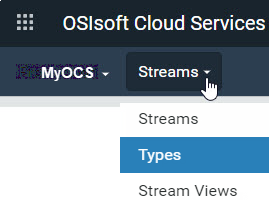

# Get started with types

After creating the namespace, the next step is to add one or more types. For more information about types, see the following topics:

- [Types](xref:ccTypes)
- [PI Server counterpart](xref:ccTypes#types-pi-server)
- [Types best practices](xref:bpTypes)

## Procedure

1. Click the  icon and click **Sequential Data Store** (under Data Management).

1. Click the **Namespace** selection button to open the `Select a Namespace` window. Select the namespace in which you want to create the stream. 
     

1. From the **Streams** drop-down list, select **Types**.
     

1. Click the  icon on the menu bar and click **Manage Default Permissions**.
   This opens the `Manage Default Permissions for New Types` window where you can specify the default permissions for new types. 

   **Note:** By default, you must be assigned the Tenant Administrator role to change the default permissions. Any changes you make only affect new types. The permissions on existing types are not changed.

   When you have finished reviewing the permissions, click **Cancel** to continue.

1. Click **Add Type**.

1. In the `Add Type` window, enter the values for these fields:

   - `Id` &ndash; **MyOCS.PumpState**

   - `Name` &ndash; **MyOCS.PumpState**

   - `Description` &ndash; **SDS Type used by My OCS**

    **Note:** You can use an existing SDS type as the starting point for the new type by selecting an existing SDS type from the **Base Type** list. When you add a base type, its properties populate the **Properties** list. You can then add other properties to the type.

1. Click  **Add Property** to add a property.

1. Complete the following fields for the first property:

   - `Key` &ndash; Select the checkbox.

     **Note:** The `Key` field identifies this property as the index. 

   - `Id` &ndash; Enter **Timestamp**.

   - `Type` &ndash; Select **DateTime**. <!-- Do we need to mention that you can filter by System or Tenant types? --> 

   - `UOM` &ndash; Leave this blank.

1. Click **Add Property** to add a second property and complete the fields:
   - `Id` &ndash; Enter **Temperature**.
   - `Type` &ndash; Select **Double**.
   - `UOM` &dash; Select **degree Celsius**.
   
1. Click **Add Property** to add a third property and complete the fields:

   - `Id` &ndash; Enter **Pressure**.
   - `Type` &ndash; Select **Double**.
   - `UOM` &ndash; Select **kilogram per cubic meter**.

1. Click  **Add Property** to add a fourth property and complete the fields:

      - `Id` &ndash; Enter **Status**.
      - `Type` &ndash; Select **String**.
      - `UOM` &ndash; Leave this blank.

      **Note:** You can select up to three properties as indexes. Drag and drop the properties in the list to order the index keys. For this exercise, we will only use the Timestamp property as an index.

1. Click **Apply**.

The following steps explore information about the type you just created.

1. Click the checkbox to select the **MyOCS.PumpState** type in the list. Click **More options** and click **Manage Permissions**.

    This opens the `Manage Permissions for MyOCS.PumpState` window where you can override the default permissions and set permissions for the specific type. You must be assigned the Tenant Administrator role to configure the type permissions.

    Review the permissions for the MyOCS.PumpState type, and when you have finished exploring this window, click **Cancel** to continue. 

1. Click **More options** and click **View Type**.

   This window shows the type details that you entered when you added the type. Click **Cancel** to continue.

1. Click **More options**  and **Get Type Streams**.

   This takes you to the **Streams** list and, by default, OCS uses the typeId:MyOCS.PumpState query to filter for any streams with the MyOCS.PumpState type. The list is currently empty, because streams have not yet been created with this type.

## Next step

Continue with [Get started with streams](xref:gsStreams).
