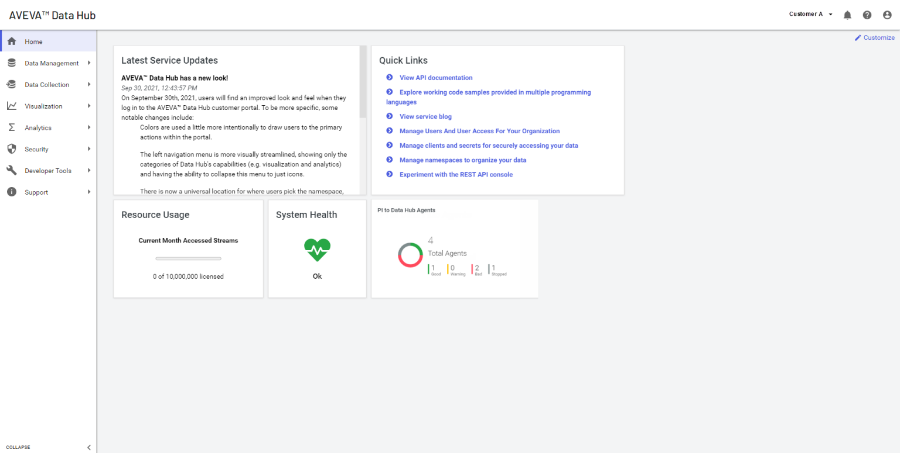
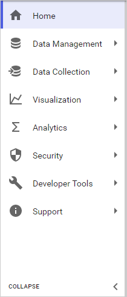
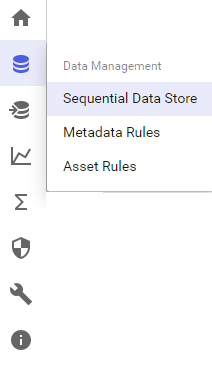
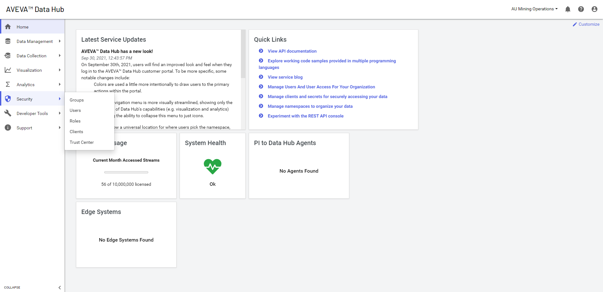
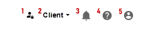

# Introduction to the OCS portal

Access and interact with OCS through the web-based portal. When you first access the portal, several panes provide information about the system's health as well as quick links to popular documentation topics.

<!--Angela Flores 6/23/21 - This screenshot has a stray tool tip from another application. It needs to be cleaned up. --> <!--VT, 8/4/21 - Screenshot replaced & published. -->

## OCS features

Expanding the left pane opens a menu of OCS features. This pane is always available in the portal, and you can make menu selections even while collapsed.

| Pane expanded | Pane collapsed |
|:--:|:--:|
|  |  |

The following features can be accessed from the menu:

- **Data Management**: Provides tools for setting up basic capabilities, including tenants, the Sequential Data Store (SDS), and metadata rules for data streams.

- **Data Collection**: Provides the ability to bring data from multiple sources and systems into a namespace.

- **Visualization**: Allows you to view data trends and use assets to set up digital twins of real-world physical entities. <!--Angela Flores 6/23/21 - this is the only place in the documentation that uses the phrase "digital twins of real-world physical entities". What feature is that trying to describe? The only thing in the Visualization portion of the documentation is Trend. -->

- **Analytics**: Provides tools for shaping and querying large datasets.

- **Security**: Allows you to specify identity providers for authentication and add groups, users, roles, and clients to your tenant.

- **Developer Tools**: Provides code samples, an API console, and an editor for the OSIsoft Message Format (OMF).

- **Support**: Provides access to documentation, logs, support links, the OCS blog, and other useful information.

## Feature pages

Clicking a menu item takes you to the related feature page.

Most pages consist of two panes:

- The left pane is where you perform the tasks associated with the resource. For example, the left pane is where you add and edit the resource or manage its permissions.

- The right pane has one or more tabs:

  - The **Details** tab contains additional information about the selected resource.

  - The **Information** tab appears in some windows and provides documentation about the current feature and how to perform relevant tasks.

  - Some resources have additional panes for other configuration tasks.

## Portal toolbar

The portal toolbar is located in the upper-right corner of the portal window.

The table below provides a list and descriptions of these toolbar commands.

| Numbered Item | Function |
|---------------|----------|
| 1 - Change Namespace dropdown menu |Click to select a different namespace. |
| 2 - View Notifications icon |Click to view OCS-generated notifications. | 
| 3 - Question mark icon | Click to access the online documentation. |
| 4 - User profile icon  | Click to view a menu of the following commands: The currently logged in user, tenant details, resource usage, feedback page, and sign out of the portal. |
| 5 - Customize link | Click to customize the layout of the portal dashboard. |
