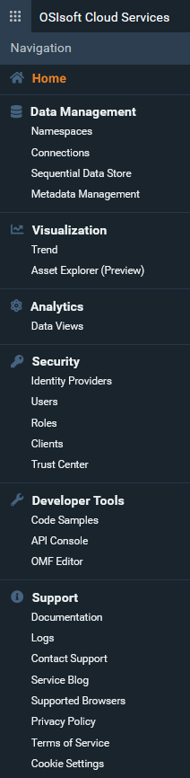
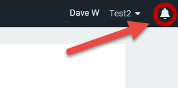
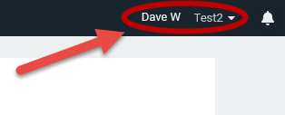

# Introduction to the OCS portal

Access and interact with OCS through the web-based portal. When you first access the OCS portal, several panes provide information about the system's health as well as quick links to popular documentation topics.

<!--Angela Flores 6/23/21 - This screenshot has a stray tool tip from another application. It needs to be cleaned up. --> <!--Victoria Touati 8/4/21 - Screenshot replaced & published to Zoomin. -->

## OCS features

Clicking the navigation icon at top left opens a menu of OCS features. This icon is always available in the OCS portal.

Click the navigation icon to access the OCS features. <!--Angela Flores 6/23/21 - I would take the feature menu screenshot out. The list below explains the contents. Given the rapid pace of development, this screenshot is always going to be out-of-date. -->

OCS includes the following features:

- **Data Management**: Provides tools for setting up basic capabilities of OCS, including tenants, connections to PI Systems, the Sequential Data Store (SDS), and metadata rules for data streams.
- **Data Collection**: Provides mechanisms to bring data from multiple sources and systems into a namespace within OCS.
- **Visualization**: Allows you to view data trends and use assets to set up digital twins of real-world physical entities. <!--Angela Flores 6/23/21 - this is the only place in the documentation that uses the phrase "digital twins of real-world physical entities". What feature is that trying to describe? The only thing in the Visualization portion of the documentation is Trend. -->
- **Analytics**: Provides tools for shaping and querying large datasets.
- **Security**: Allows you to specify identity providers for authentication and add users, roles, and clients to your tenant.
- **Developer Tools**: Provides code samples, an API console, and an editor for the OSIsoft Message Format (OMF).
- **Support**: Provides access to documentation, logs, support links, an OCS blog, and other useful information.

## Feature pages

Clicking a menu item takes you to a page for that feature.

Most pages consist of two panes:

- The left pane is where you perform the tasks associated with the OCS resource. For example, the left pane is where you add and edit the OCS resource or manage its permissions.
- The right pane has one or more tabs:
  - The Details tab contains additional information about the selected resource.
  - The Information tab provides documentation about the current feature and describes how to perform relevant tasks.
  - Some resources have additional panes for other configuration tasks.

## Notifications

At top right, the View Notifications icon lists any OCS-generated notifications.

## User and tenant information

At top right, a drop-down menu gives you access to the following information about your user profile and tenant:

- Tenant information
- Resource usage data
- User profile information and roles assigned to your user

The menu also provides a link to a page where you can give feedback about OCS.

