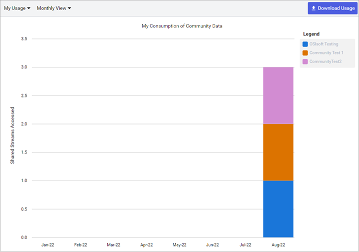
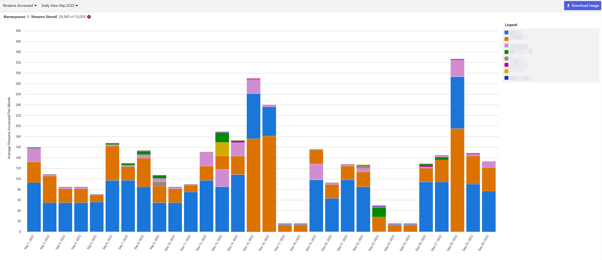
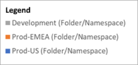

# Resource usage

The `Resource Usage` page displays the streams created and viewed within your tenant or from a community as a bar graph. The graph contains two parameters that you can edit: data source and views.  

## To view resource usage

1. Select the **User profile** icon .

1. Select **Resource Usage**.

1. Review [License usage](#license-usage).

1. Choose a data source: **Streams Accessed** or **Shared Streams Accessed**. For more information, see [data sources](#data-sources).

1. Choose a time increment: **Monthly View** or **Daily View**. For more information, see [View](#view).

1. (Optional) Select **Download Usage** to download  the displayed data.

## License usage

Resource usage always displays your license information, regardless of what page parameters you select. This license information lists your total number of licenses available along with the number consumed.

Field | Description
--|--
**Namespaces** | The total number of namespaces the tenant is licensed for and the number of licenses consumed.
**Created Streams** | The total number of streams the tenant is licensed for and the number of licenses consumed.
**Current Month Accessed Streams** | The total number of streams the tenant is licensed the access during the month and the number of licenses consumed.

##  Data sources

For data source, you can view streams from your native tenant namespaces or from communities you are a member of. Choose between the following options:

- **Streams Accessed**: Displays usage data about streams native to your tenant namspaces.

- **Shared Streams Accessed**: Displays usage data about streams shared into communities that your tenant holds membership in.

## View

Use the view dropdown to display streams accessed by month or day. Choose between the following options:

- **Monthly**: Displays usage data for the chosen data source for the past seven months, broken down by month.

	

- **Daily**: Displays usage data for the chosen data source for each day in a chosen month.

	

## Legend

Regardless of which parameters you choose, resource usage always display a legend that maps the colors of the graph to each data source. The legend also lists whether the data source is a native namespace or a shared community namespace. 

## Tabular data

Regardless of which parameters you choose, the data displayed in the bar graph is also displayed below it as tabular data. View the [Legend](#legend) to see how the stream data maps to a data source. You can download this data in CSV format by selecting **Download Usage**.

## Video Tutorial: View your AVEVA Data Hub usage

<iframe width="560" height="315" src="https://www.youtube.com/embed/Y-GxLMH1vYA" title="YouTube video player" frameborder="0" allow="accelerometer; autoplay; clipboard-write; encrypted-media; gyroscope; picture-in-picture; web-share" allowfullscreen></iframe>