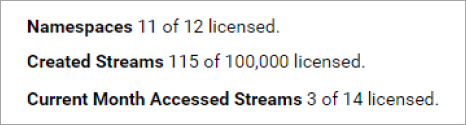

# Resource usage

The `Resource Usage` page displays the streams created and viewed within your tenant as a bar graph. The graph contains two parameters that you can edit: data source and time.  

## To view resource usage

1. Select the **User profile** icon .

1. Select **Resource Usage**.

1. Review [License usage](#license-usage).

1. Choose a data source: **Namespace Streams** or **Community Shared Streams**. For more information, see [data sources](#data-sources).

1. Choose a time increment: **Monthly** or **Daily**. For more information, see [Time increment](#time-increment).

1. (Optional) Select **Export** to export the displayed data.

## License usage

Resource usage always displays your license information, regardless of what page parameters you select. This license information lists your total number of licenses available along with the number consumed.

**License information**

Field | Desription
--|--
**Namespaces** | The total number of namespaces the tenant is licensed for and the number of licenses consumed.
**Created Streams** | The total number of streams the tenant is licensed for and the number of licenses consumed.
**Current Month Accessed Streams** | The total number of streams the tenant is licensed the access during the month and the number of licenses consumed.

##  Data sources

For data source, you can view streams from your native tenant namespaces or from communities you are a member of. Choose between the following options:

- **Namespace Streams**: Displays usage data about streams native to your tenant namspaces.

- **Community Shared Streams**: Displays usage data about streams shared into communities that your tenant holds membership in.

##  Time increment

Time increment can display streams accessed by month or day. Choose between the following options:

- **Monthly**: Displays usage data for the chosen data source for the past seven months, broken down by month.

	

- **Daily**: Displays usage data for the chosen data source for each day in a chosen month.

	

## Legend

Regardless of which parameters you choose, resource usage always display a legend that maps the colors of the graph to each data source. The legend also lists whether the data source is a native namespace or a shared community namepsace. 

**Legend**

## Tabular data

Regardless of which parameters you choose, the data displayed in the bar graph is also displayed below it as tabular data. View the [Legend](#legend) to see how the stream data maps to a data source. You can export this data in JSON format by selecting **Export**.