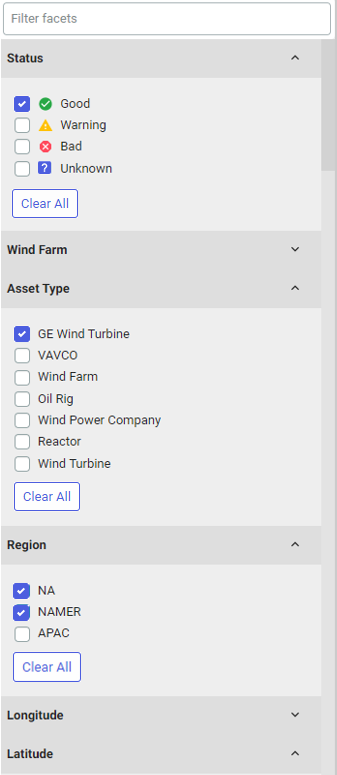
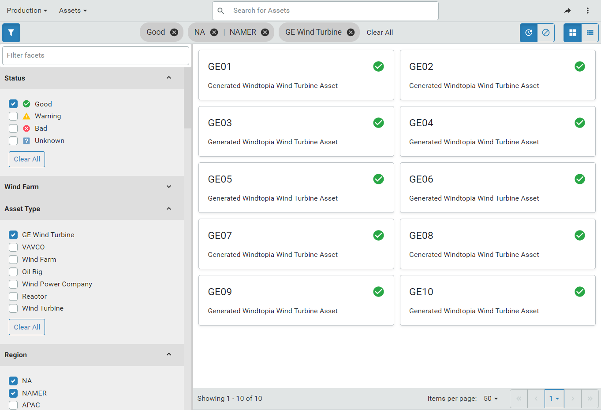

# Filter assets in the Asset Explorer

Monitor and manage assets by applying filters in the Asset Explorer. Filters allow you to find specific assets quickly regardless of how many assets your organization has. Customize and refine your search filter by selecting multiple filter values. Use metadata filters to refine your search using these filter facets:

- Status &ndash; Filter for assets that have the same status. For example, filter for assets with a status of `Warning` or `Bad` to identify assets that may need attention.

- Asset Type &ndash; Filter for assets based on asset type.

- Metadata &ndash; Filter for assets based on metadata, such as `Location`, `Manufacturer`, `Province` or `State`, `Region`, or `Model`.
 
Follow this procedure to filter assets in the Asset Explorer:

1. Log in to OSIsoft Cloud Services.

1. Click the navigation icon  and select **Visualization > Asset Explorer**. 
   
    The asset explorer displays the available assets. 

1. Click the  icon to open the `Metadata Filters` pane.

   - Status always appears at the top of the filter facets list. 

   - The remaining metadata facets appear in order, with the most frequently occurring facet appearing first, followed by the remaining facets in descending order. In the screen capture below, the `Wind Farm` facet occurs most frequently in the assets. 

     <!--WRITER'S NOTE: This might change so that Asset Type always follows Status. If so, the screen captures below will also have to be updated. -->

   - The first ten values of each facet are displayed. If there are more than ten values, click **Show More** to see the complete list of values. 

     
   
1. Enter the name of the metadata facet in the **Search** field to find a particular facet.

1. Select one or more values from one or more facets to apply the filters to the listed assets.

   If you select multiple choices within a facet, an **Or** operator is used. For example, in the screen capture below, the assets must belong to either the `NA` and `NAMER` regions. Across facets, an **And** operator is used. In the example below, the assets must have one of the selected values for the `Status`, `Asset Type`, and `Region` facets. As you select facet values, the assets that match the values are updated and displayed in real time. The asset search chips appear in the menu bar so you can see how your asset view is filtered. 

   The screen capture below shows how you can apply multiple filters in combination to create a unique view for your fleet of assets. The assets displayed have a status of `Good`, they are based on the `GE Wind Turbine` asset type, and the assets are either in the `NA` or `NAMER` region. 

   **Note:** `Wind Farm` is the most frequently occurring facet on the assets. However, it is not used to filter this asset view.
   
   
   
   Click the **X** to remove a facet or remove all facets by clicking **Clear All**. 
   
   This view of assets is saved within a session or between sessions. 
