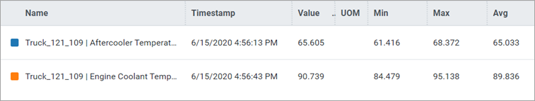
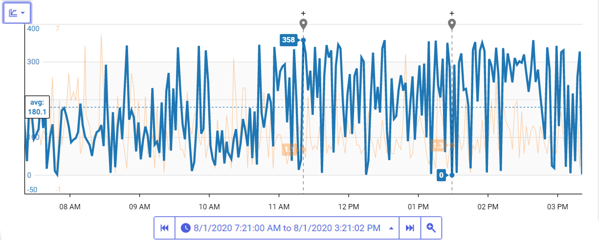

# Get started with remote operations monitoring

OSIsoft Cloud Services (OCS) makes it possible to monitor remote assets in real time. The immediate access to data about the status of assets gives you the ability to anticipate problems and proactively perform preventative maintenance.

For example, a fleet manager of a mining truck dealer sells trucks to companies worldwide. His company provides monitoring and maintenance services to their customers. With remote monitoring, he reviews the status of the trucks each day, identifies trucks with problems, uses the data collected on different measurements to identify possible causes, reviews the history of these measurements over time, and shares the information with colleagues in the field who can follow up on the problem.

The following procedure describes how to use the portal to monitor your assets and quickly identify problems. The screen captures are taken from the scenario described in the example above.

## Procedure

1. From the left pane, select **Visualization** > **Asset Explorer**. 
   
    The asset explorer displays the available assets. In this example, it provides an overview of the health of the fleet of trucks.

    **Tip:** Click on the  icons in the toolbar to toggle between the card and table views of the assets.
 
3. Scan through the assets and identify any assets with a problematic status.

    **Tip:** Use the Search box to filter the list of assets displayed.

    Each asset is identified with one of the following statuses:

    | Icon   | Status  |
    | ------ | ------- |
    |  | Good    |
    |  | Warning |
    |     | Bad |
    |     | Unknown |

1. Click on an asset to open the Asset Details pane.

   The `Asset Details` pane provides metadata and property data on the asset that you can use to determine the cause of any problems. The **Metadata** tab displays metadata associated with the asset.

1. Click the **Measurements** tab.

    The `Asset Details` pane displays the following:
    
     - Data associated with the asset. These values are updated in real time.
    
     - A trend of the selected measurements.

1. Select one or more of the properties that might be the cause for the warning.

1. Review the history of the selected properties in the trend to see if the data suggests you have identified a potential cause. 

    By default, the trend shows the property data for the last 8-hour period. Use the navigational arrows on the Time picker  to pick another time-range option or specify a custom time range.

1. To see the details of these properties, click the **View full trend**  icon to see the Trend page.

    Note the following:

     - The Trend page shows the properties for the same time range shown in the `Details` pane of the Asset Editor.

     - There are three views of the trend:

      | Trend View                               | Description                                   |
      | ---------------------------------------- | --------------------------------------------- |
      | Single  | Each trace is displayed in its own trend.     |
      | Multiple        | All properties are plotted on the same scale. |
      | Stacked | All properties are plotted on its own scale.  |

1. Click the  icon to toggle through the views.

    **Note:** The legend table shows the legend for each trace, the last value, minimum, maximum, and average values in the displayed time range.

    
    
1. The error may not have occurred in the time range currently in view. Click **Step backward** or **Step forward** to move the time range backward or forward.

    **Note:** The trace will move in increments of time that are displayed in the trend. If the trend displays the last 12 hours, use the step backward arrow in the Time picker to show the previous 12-hour period. If it displays the last 30 days, the step forward arrow shows the next 30-day period.

1. Click on a trace to select it for further analysis.

    The trace is highlighted, and two cursors automatically mark the minimum and maximum values for the displayed time range.

    

    Click **+** above the trace to lock the cursor in place. The **+** turns into an **x**. Click the **x** to unlock the cursor.

1. Add other cursors at data points of interest.

    **Note:** When two cursors are locked, the legend table displays summary calculations for the values between the two cursors.

1. Click the link icon  in the menu bar to copy the URL of the workspace.

    Share this link to give others the same view of the trend that they can then use to troubleshoot problems.
