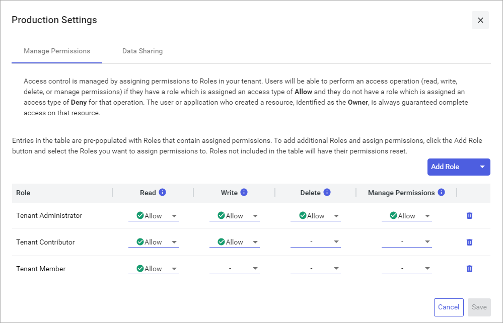
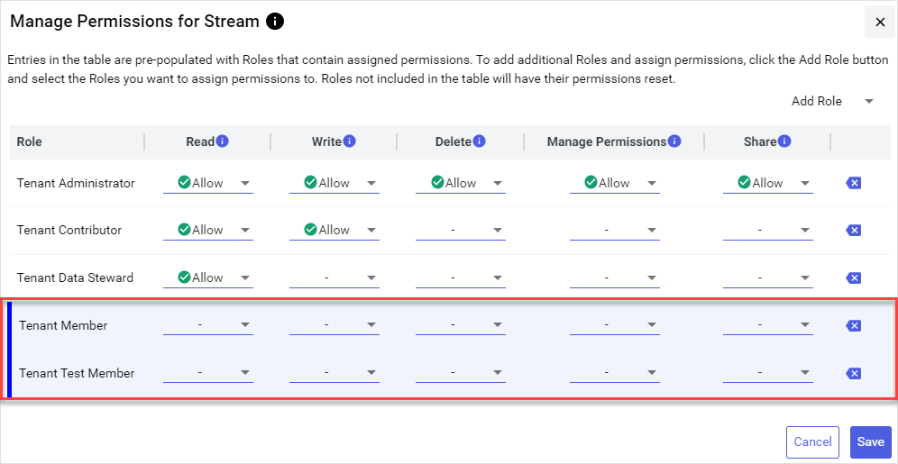

# Permissions management

Within OSIsoft Cloud Services, permissions are applied to [user roles](xref:ccRoles) per resource. The user roles assigned to each user determine whether they can access the resource. You can granularly edit permissions for the following system resources. Open the following pages for instructions on how to edit permissions for each system resource. 

- [Agents](xref:manage-agent-permissions)
- [Asset Rules](xref:manage-asset-rules-permissions)
- [Asset Types](xref:manage-asset-type-permissions)
- [Assets](xref:manage-asset-permissions)
- [Data Views](xref:manage-data-views-permissions)
- [Namespaces](xref:namespaces-manage-permissions)
- [Streams](xref:streams-manage-stream-permissions)
- [Types](xref:types-manage-permissions)

## Manage Permissions window

All system resources are managed using the `Manage Permissions` window. Use this window to apply permissions to each user role for a system resource. This window displays a matrix of roles, permissions, and permission settings for the resource you are managing. Use the matrix to:

- Add new roles that have permissions on the resource.

- Update individual permission settings.

### To add roles

Add roles that have permissions for the resource by selecting **Add Role** > **Add** .

### To remove roles

Remove newly added roles by selecting the **Remove**  icon. Roles that were added previously cannot be removed because they already have permissions assigned that must be cleared first. For more information, see [To clear permissions for a role](#to-clear-permissions-for-a-role).

### To edit permissions

**Read**, **Write**, **Delete**, and **Manage Permissions** permissions can be edited for each user role that has permissions on the resource. Data stream resources include an additional **Share** permission to support <xref:communities>. Mouse over each **Information**  icon for more information about each permission.

- To allow a permission, select  **Allow**.

- To explicitly deny a permission, select  **Deny**. 

    **Note:** When a user is assigned multiple user roles with conflicting permissions, a setting of  **Deny** supersedes a setting of  **Allow** or undefined (`-`) .

### To clear permissions for a role
    
Clear the permissions applied to a role by selecting **Backspace** .

**Notes:**

- Allow Manage Permissions access is required on at least one role.
                          
- If you clear all permissions from a role for a resource, the role is not listed the next time that you manage permissions for the resource.

### Modified roles

Roles that are highlighted indicate that one of more of its permissions settings have been modified. Newly added roles are highlighted as well. You can restore the original settings by selecting **Cancel**.

**Modifed roles**

