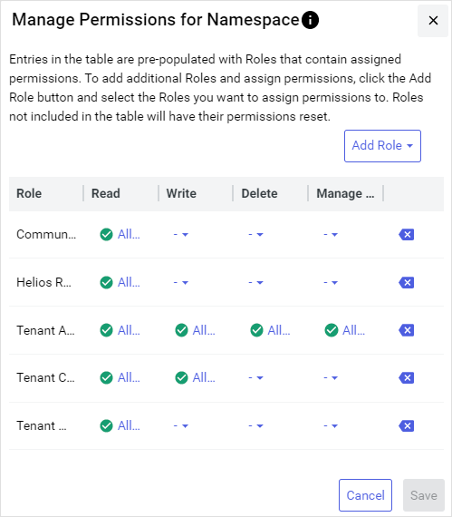

# Manage permissions for user roles

You can edit the permissions applied to a user role from any page in OSIsoft Cloud Services. You can apply different permissions to different user roles for each namespace. To manage permissions for user roles:

1. From the **Namespace** dropdown, select the namespace that you want to edit permissions for.

1. Select the **Manage Permissions**  icon.

    

    The `Manage Permissions for Namespace` window opens.

1. Use the `Manage Permissions for Namespace` window to:

    - Add user roles that have permissions in the namespace.
    - Edit permissions for each user role.

    For more information, see [Manage Permissions for Namespace window](#manage-permissions-for-namespace-window).

1. When you are finished editing permissions, select **Save**.

    **Note:** This action overwrites any previous permission settings applied to the affected user roles.

## Manage Permissions for Namespace window

Use the `Manage Permissions for Namespace` window to apply permissions to each user role for the currently selected namespace. This window lists a matrix of roles that have permissions for the selected namespace, along with the setting for each individual each permission. Use this matrix to add new roles that have permissions in the namespace or update individual permissions.

### To add roles

Add roles that have permissions for the selected streams by selecting **Add Role** > **Add** .

### To remove roles

Remove newly added roles by selecting **Remove** . Roles that were added previously cannot be removed because they already have permissions assigned that must be cleared first. For more information, see [To clear permissions for a role](#to-clear-permissions-for-a-role).

### To edit permissions

Read, write, delete, manage permissions, and share permissions can be edited for each user role that has permissions in the namespace. Mouse over each **Information**  icon for more information about each permission.

- To allow a permission, select  **Allow**.

- To explicitly deny a permission, select  **Deny**. 

    **Note:** When a user is assigned multiple user roles with conflicting permissions, a setting of  **Deny** supersedes a setting of  **Allow** or undefined (`-`) .

### To clear permissions for a role
    
Clear the permissions applied to a role by selecting **Backspace** . 

**Notes:**

- Allow Manage Permissions access is required on at least one role.
                          
- Roles that have no permissions assigned are not listed the next time that you manage namespace permissions.

### Modified roles

Roles that are highlighted indicate that one of more of its permissions settings have been modified. Newly added roles are highlighted as well. You can restore the original settings by selecting **Cancel**.
