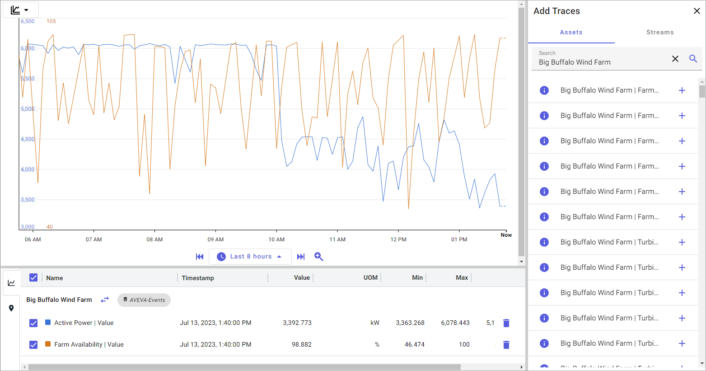
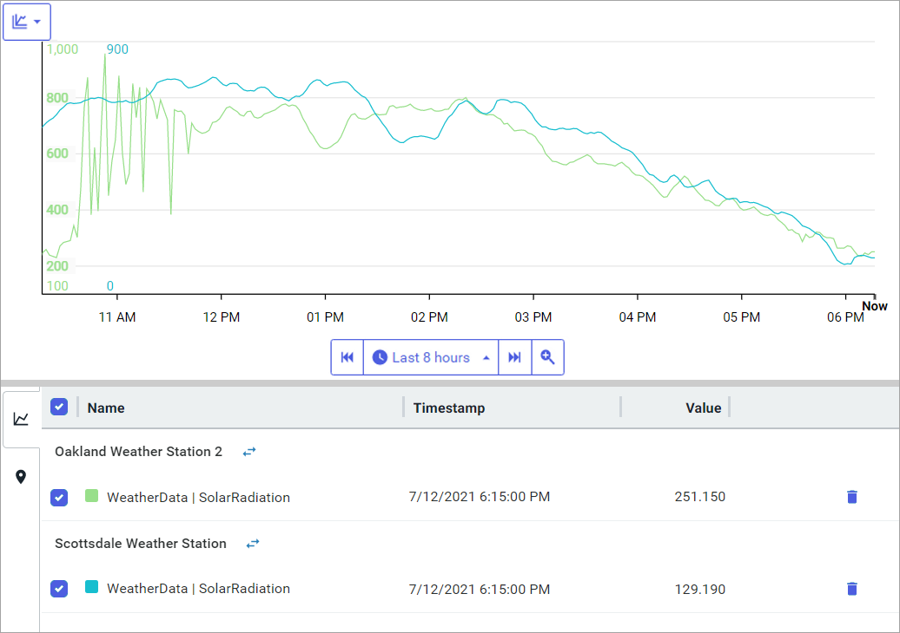
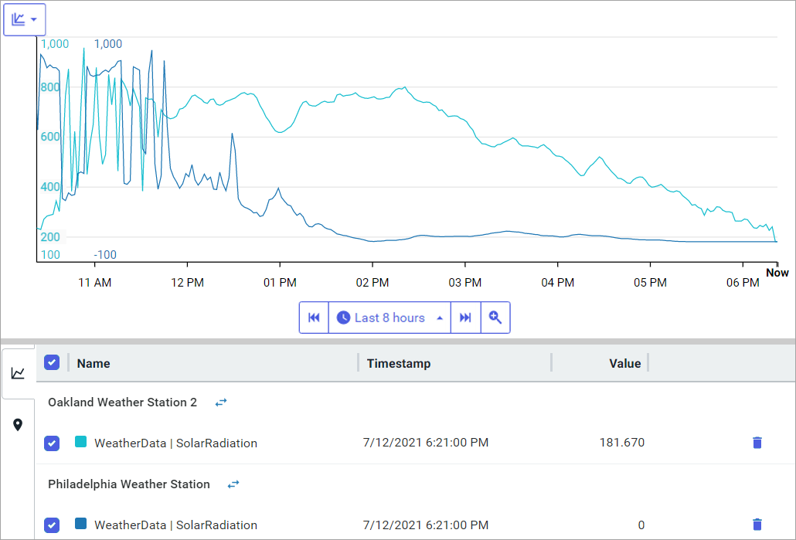

# Context switch in visual trending

On the Trend page, you can switch between assets that are created with the same asset type. Instead of searching for and adding the traces for each asset, use the Swap Asset feature to streamline this process. You add the traces for a single asset, and then you use the Swap Asset feature to replace the asset in the trend with another asset.  

## Asset switch in visual trending

Follow this procedure to switch assets in a trend:

1. On the Trend page, click the **Assets** tab in the `Add Traces` pane. 

1. Add one or more traces for the same asset to the trend.

   **Note:** The asset must be created from an asset type.

   The screen capture shows several traces for the `Philadelphia Weather Station` asset. The data displayed show the wind speed, wind direction, and the relative barometric pressure.

   

1. Click the  icon next to the asset name in the legend table to open the `Swap Asset` window. 

   **Note:** The `Swap Asset` window displays a list of assets of the same asset type.

1. Select the asset to view and click **Continue**.

   **Note:** The `Trend` page replaces the traces of the original asset with the new asset.

## Asset switch in performance testing

Switching between assets is useful in performance testing and benchmarking. For example, assume Asset A provides the standard against which other assets are compared. You add Asset A and Asset B to the trend and compare B against A. Then use the Asset Swap feature to replace Asset B with Asset C, and compare C to A.

Follow this procedure to switch assets while performance testing:

1. On the Trend page, click the **Assets** tab in the `Add Traces` pane. 

1. Add a trace for the asset that provides the standard for all assets.

1. Add a second trace for an asset to compare against this standard.

   In the screen capture below, there are two traces with solar radiation data. In this example, the Oakland Weather Station is the standard and the Scottsdale Weather Station trace is compared against it.

   

1. Click the  icon for the asset you are comparing with the standard.

   In this example, click the  icon for the `Scottsdale Weather Station`.

1. In the `Swap Asset` window, select another asset and click **Continue**. 

   In this example, the solar radiation trace for the `Scottsdale Weather Station` is replaced with the solar radiation trace for the `Philadelphia Weather Station`. Now you can compare the trace for the `Philadelphia Weather Station` against the `Oakland Weather Station`.

   
